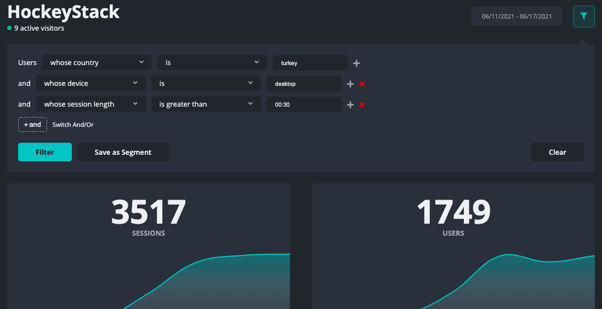
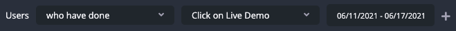
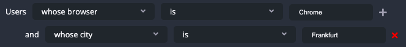
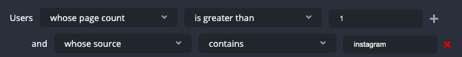

# Filtering

One of the best features of HockeyStack is its ability to drill deep down into your data. Filtering is a great way to achieve this.

With HockeyStack's and/or logic, you can find any type of segment you want.

You can filter your main dashboard, your user journeys, and your funnels. You can always add new filters and delete existing ones from the controllers at the end of each row. If you are done, you can click "**Clear**" and the filter will reset along with the data shown.

You can save this filter to use it later by clicking "**Save as Segment**". Segments are very similar to filters, and you can access them again from the first dropdown of any row you see in the filtering box.

HockeyStack offers three main categories of filters that you can use.

### Actions

The filters in this category are "**who have done**" and "**who have not done**".

Selecting one of them will show you a second set of dropdowns where you can choose from your goals or the pages that HockeyStack tracked. This will give you the goals or the pages that your visitors have performed/visited. Of course, you can always negate it with a "who have not done".

The last dropdown is a date picker, where you can limit this action to be specifically done within this period.

<aside>
⛔ When you negate this category, for every option other than "**enter site**", it will give you the visitors who have not done this action still within the chosen period. For "**enter site**", it will mean all visitors who have not visited your site during this period.

</aside>

## User Properties

The filters in this category refer to the properties of the visitors themselves, and not their sessions.

- **whose fields**: To filter results according to whether they have the necessary field or property. This is much more useful for city data, along with identity and other custom properties in the near future.
- **whose country**: To filter results according to the country of the visitor. This data is obtained through the IP address. It accepts country codes as well. Ex. "TR", "Turkey", or "turkey".
- **whose city**: To filter results according to the city of the visitor. This data is obtained through the IP address.
- **whose language**: To filter results according to the language of the visitor. This data is obtained through the browser's language. It accepts the browser language format. Ex. "en", "tr", "en-us".
- **whose device**: To filter results according to the device of the visitor.
- **whose os**: To filter results according to the operating system of the visitor.
- **whose browser**: To filter results according to the browser of the visitor.
- **whose initial source**: To filter results according to the initial source of the visitor. This is the source/referrer we tracked for their first visit. It accepts referrer domains as well as UTM tags. Ex. "facebook", "utm_source=facebook", or "ref=producthunt".
- **whose initial page**: To filter results according to the initial page of the visitor. This is the first page they landed on in your website. It accepts any page that HockeyStack can find in your website.

This category mostly has an input field instead of a date picker to complete your filter. The operators are "**is**", "**is not**", "**contains**", and "**does not contain**". "i**s**" and "**is not**" look for exact matches, while "**contains**" and "**does not contain**" look only for a part of the string.

<aside>
👉 For the initial source, we advise you use "contains" instead of "is".

</aside>

## Session Properties

The filters in this category refer to the properties of the individual sessions that HockeyStack tracks.

- **whose source**: To filter results according to the source of the session. It accepts referrer domains as well as UTM tags. Ex. "facebook", "utm_source=facebook", or "ref=producthunt".
- **whose session length**: To filter results according to the length of the session. It accepts the "minutes:seconds" format. Ex. "0:50" is 50 seconds, and "1:30" is 90 seconds etc.
- **whose first page**: To filter results according to the first page of the session. This is the first page a visitor landed on in this session. It accepts any page that HockeyStack can find in your website.
- **whose page count:** To filter results according to the page count of this session. This is especially useful to analyze bounces (where the page count would be 1).

---

If you have any other questions or issues, you can always reach us through the live support or just sending an email to [hello@hockeystack.com](mailto:hello@hockeystack.com)!