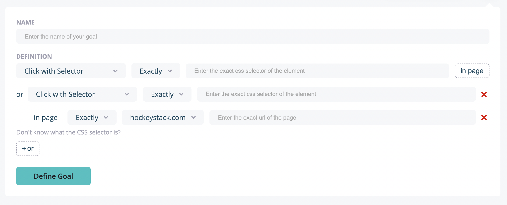

# Goals

# Defining Goals

Defining goals is the easiest thing with HockeyStack! There are a couple of ways to go about it:

1. **Defining pageviews as goals:** Select "View" from the first dropdown.
2. **Defining clicks as goals using the CSS selector:** Select "Click with Selector"
    
    [Finding Out a Button's CSS Selector](Goals/Finding-Out-a-Button's-CSS-Selector.md)
    
3. **Defining clicks as goals using the button text:** Select "Click with Text"
4. **Defining custom goals**: After you send a custom goal, it will appear on the first dropdown.

After selecting your preferred option, you can then choose how you want to enter your input:

1. **If you know exactly what you want to define,** select "Exact" from the second dropdown
2. **If you want to match multiple similar pages/buttons,** select "Contains".
3. **If you are an advanced user,** you can use "Regex" for ninja-like goal definitions.

Optionally, if you want to restrict your search to elements on a certain page, you can click "in page" and select one.

You will notice that page selection inputs have a dropdown that shows your domain. If you have a connected domain, this domain will show up here for you to use. However, you can also select the "All" option to match all of your connected domains.

You also may have noticed that goal definition only has the "or" extension. If you think you need to use the "and" extension, you most likely have a use case for the [Segments feature](Segments.md). If you are sure that your use case fits Goals better, please tell us through the live chat or through hello@hockeystack.com.

# The Goals List

The goals list gives you an overview of how your goals are performing. At one glance, you can see how many times each of your goals were done, and how that compares to the previous timeframe.

Clicking on a goal toggles that goal's details. You can see a bigger, hover-friendly graph of how many times this goal was done. You can also see the top referrers.

Clicking the "See in dashboard" button takes you to the Dashboard, filtered by users who have done that goal in the selected timeframe. This way, you can see detailed breakdowns of your goals in terms of page, source, device etc. For example, if you are tracking an e-commerce purchase as a goal, you can click "See in dashboard" to see what other products they viewed and tailor your product recommendations for higher sales.

---

If you have any other questions or issues, you can always reach us through the live support or just sending an email to [hello@hockeystack.com](mailto:hello@hockeystack.com)!