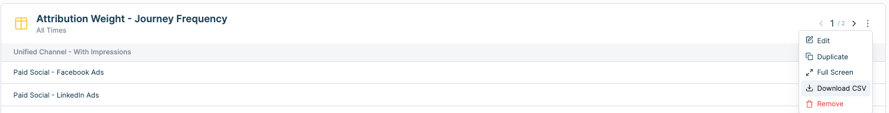

# Defining Custom Attribution Weights

We all know not all attribution touchpoints are created equal. But how does a LinkedIn Impression measure up to an invite-only Exec dinner Event? 

Determine the relative value of each touchpoint, then normalize the values between 0 and 1. This gives you your Custom Attribution Weights to apply to your Unified Channel defined property. 

### Step 1 - Find the frequency of each action in a given journey.

- Create a table report with “all time” date range. Breakdown by Unified Channel. Measure Any Action - Times Done divided by Any action - Companies.

[https://app.arcade.software/share/0O48TKbPkTYbGAVqj05W](https://app.arcade.software/share/0O48TKbPkTYbGAVqj05W)

### Step 2 - Calculate the relative weight of each touchpoint.

i.e. 5 LinkedIn vs 2 Events. The relative weight of Events against LinkedIn is 5/2 = 2.5

- Add your table to a dashboard to export, and export your table to a csv.

- Import the data from your Frequency Report to a spread sheet
    - Make of copy of this template: [[Template] Calculate Attribution Weights](https://docs.google.com/spreadsheets/d/1LflKkxHWUyFQXdSHW4wBxiEuLxEEVqIAEqRpoGsXVSo/edit?usp=sharing)
- Column E gives you the normalized value of the relative weight.

### Step 3 - Add your weights to your Unified Channel Property

- Navigate to Properties > Unified Channel > toggle on “Custom Attribution Weights” > add each weight from Column E.

[https://app.arcade.software/share/6NCwytTdWm2jqHHmje6k](https://app.arcade.software/share/6NCwytTdWm2jqHHmje6k)