# Google Ads Benchmarks - How to make your own report

HockeyStack automatically matches ad platform data (such as spent, clicks, and impressions) with website visits and CRM data - if you are using unique UTMs across your ad platforms. This goes even a step further- if you are using unique UTMs across ads, HockeyStack can match ad data with website data and CRM data, which allows you to see the impact of each ad on leads, pipeline, and revenue.

This report focuses on Google Ads, but you could get it easily for every ad channel you use.

In order to create this report, go to the dashboard, and click “+” to add a new report

Then, select “Table” report type

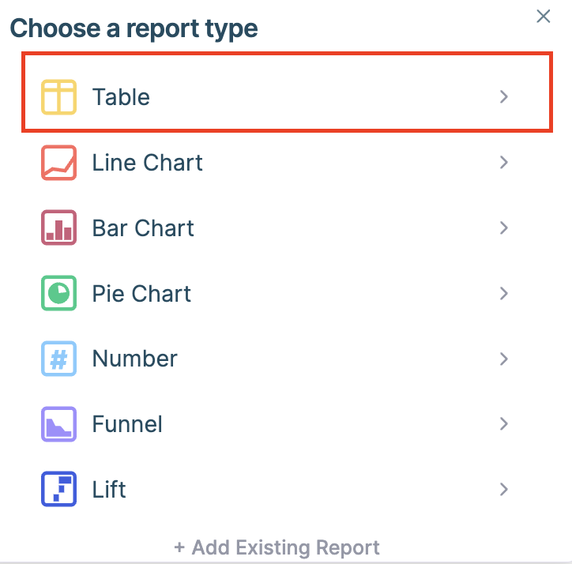

Next, Name the report (1) and select the date range (2) you want to see the data for

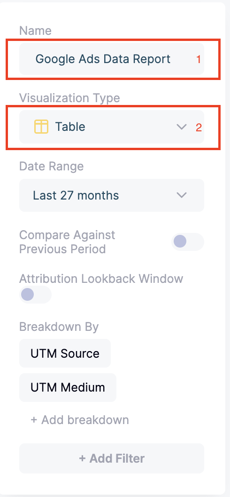

Now that you have selected the date range, we will be adding the Date to a breakdown (1) - this will allow us to have the data broken down (grouped) by hour, day, week, month, or quarter (2).

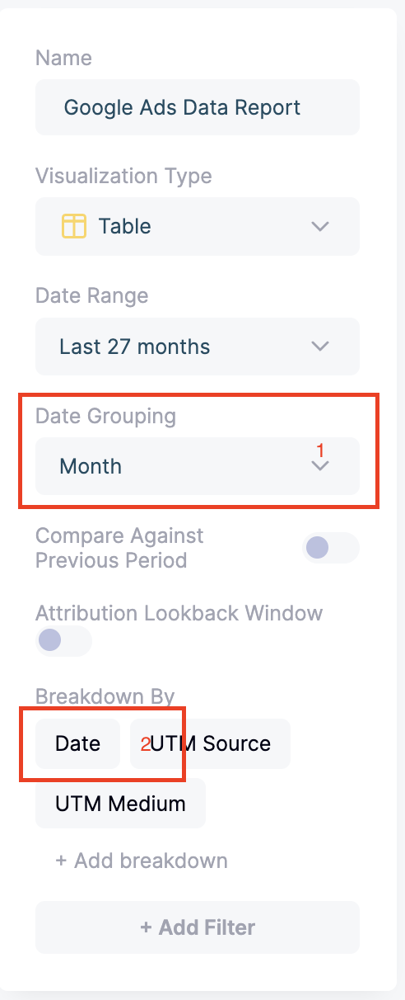

Next, we will breakdown into either:

- Source - if you have set up source properties to show Paid Social, Organic Social, Paid Search, Organic Search, Affiliate, Referral etc.
- UTM Source and UTM Medium - if you don’t have the Source (or similar) property set up in the HockeyStack

In this example, we will use UTM Source and UTM Medium. You are more than welcome to add UTM Term if you want to get more granular with the data, for example, if your UTM Term mentions Keywords or Broad/Phrase match.

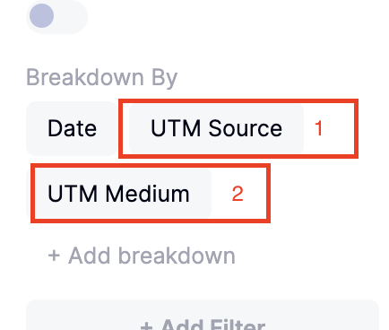

Next, we will add 3 Paid Ads Metrics columns.

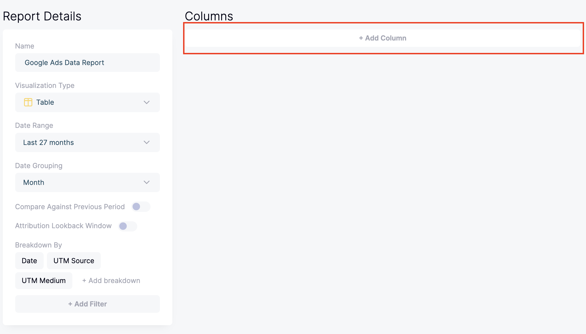

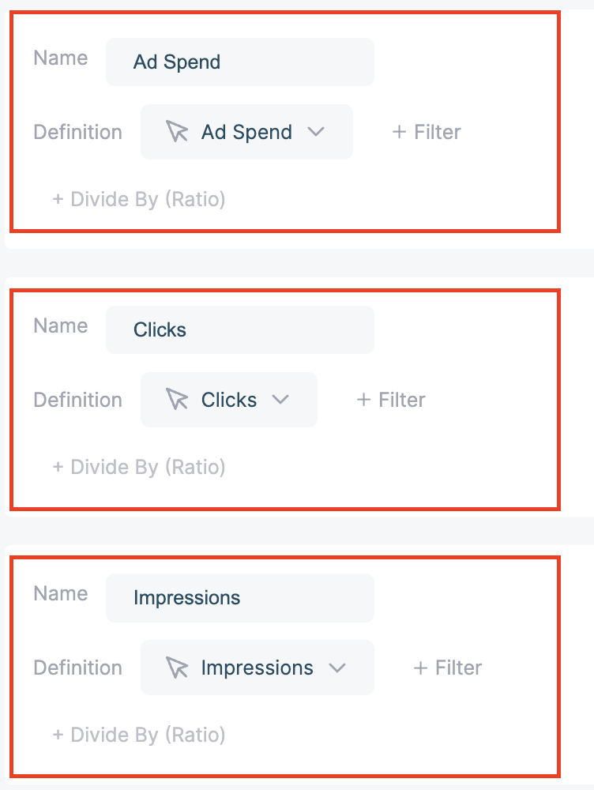

Followed by that, we will add another column, this time Website Metrics (1)  -> Pageviews (2)

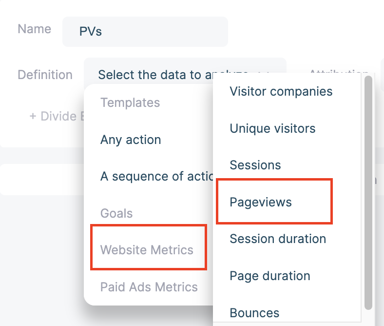

Finally, we will be adding Lead, Pipeline, and Revenue Data. HockeyStack allows you to customise the definition of these goals, so they may vary between companies. For the purpose of this example, we have 3 goals that we will be using

1. MQL defined as Goal: MQL, analysed on Company Level property

2. Pipeline, defined as Goal: Deal Created, with Deal Amount property

3. Revenue, defined as Deal Closed Won, with Deal Amount property

In order to add them, we will be creating extra 3 columns in the report

1. For MQL, it’s a straightforward setup, as mentioned above

1. For Pipeline, we will be setting up a sequence of actions (1), with the first step being MQL, and the second step being Deal Created.

Additionally, we will keep MQL Used for breakdown (1) and Deal Created for time range (2).

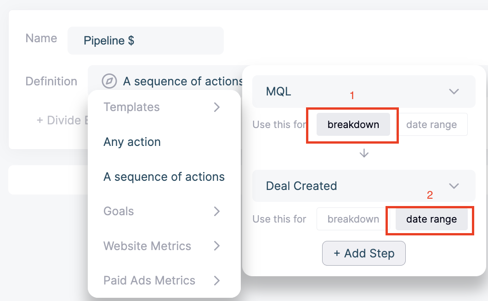

By selecting a breakdown for the MQL action, it will be used as a breakdown for our Date breakdown, meaning that the data will be tied to the date when MQL happened. Additionally, thanks to choosing MQL as a breakdown, the attributable touchpoints that we will be accounting for will be only until the lead was captured (MQL).

By selecting a time range for Deal Created, Deal Created action data will be displayed for the date range you have chosen for his report - meaning that it will show you Deal Created (value) data for the time range you selected when creating this report.

Finally, select Deal amount (1) as a property for this column, and attribution model (2) you would like to use. You are more than welcome to choose Companies as a property - if you do so, instead of pipeline, you will see number of companies that got to the “Deal Created” Stage, with Position Based Attribution.

1. For Revenue, we will be using a sequence of actions (1), with the first step being MQL (2), and the second step being Deal Closed Won (3). We will be keeping MQL for breakdown, and Deal Closed Won used for time range.

We will be using the Deal Amount property and Attribution model of your choice in this column as well.

This is the setup for the report. Thanks to this setup, what you will see is data broken down by date, UTM source and UTM medium, with ad spend, clicks, impressions, pageviews, MQLs, pipeline generated from these MQLs (with touchpoints accounted only until the point when the lead was captured), and revenue from these MQLs).

The data you will see will be for all UTM Sources and UTM Mediums you used within the Date Range you have chosen, so for example (if you integrated with us) Google Ads, Facebook Ads, Reddit Ads, LinkedIn Ads etc.

If you would like to see the data only for specific channels, we will have to use filters - likely in the UTM Source or UTM filter, depending on your company’s UTM Structure. In order to do so go back to edit the report by clicking 3 dots in the top right corner, and then edit.

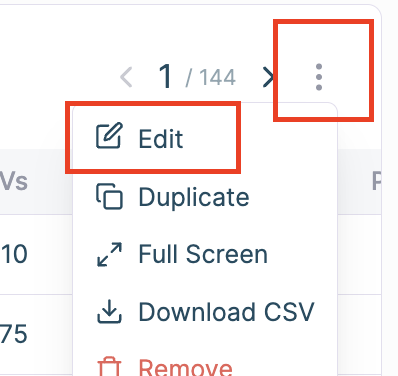

The next step is to click on the property we want to filter and click filter.

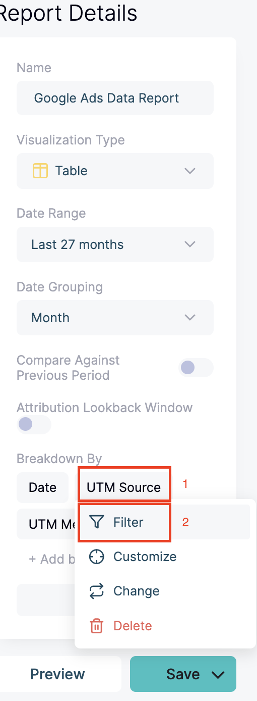

Finally, apply the appropriate filters (in our case to see Google Ads data only)

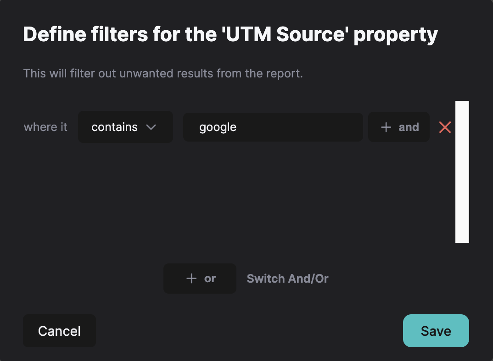

And save the filter. Then save the dashboard, and you will see data only for channel you used in the filters.

If you wanted to calculate CPC, CPM, or CPL, you could easily just add one more column in HockeyStack report for each data you want to calculate.

Add CPC and CPM Calculations, and CPL If needed. Let’s say you want to calculate CPC, then add the definition you want to divide it by - in our case it’s Ad Spend

Then click “Divide By (Ratio)”

And then add what you want to get divided - in our case it’s clicks

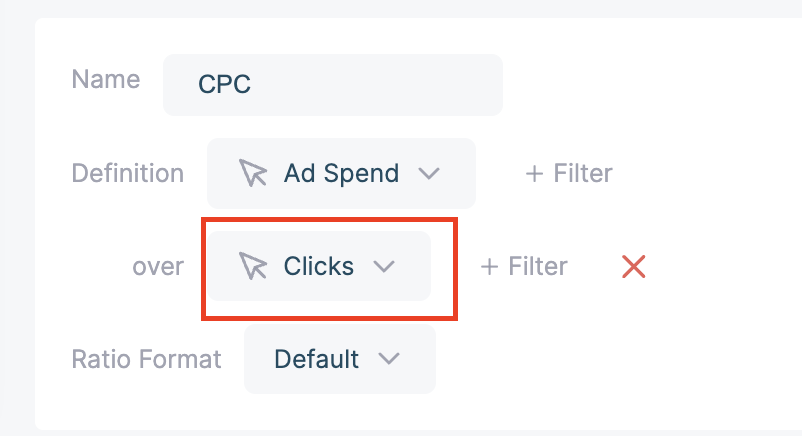

You can find more information about Sequences in this guide[https://docs.hockeystack.com/data-visualization/sequences](https://docs.hockeystack.com/data-visualization/sequences).