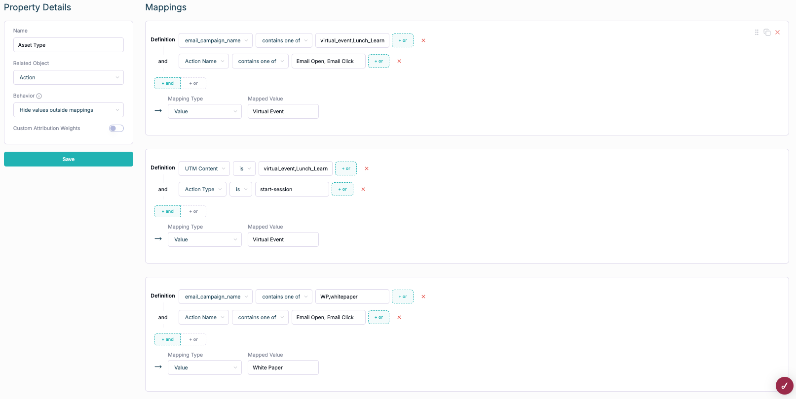

# How To: Build an Asset Type Defined Property

Assets are an important part of the Touchpoint Hierarchy (learn more here: [https://docs.hockeystack.com/data-visualization/marketing-touchpoint-hierarchy#block-c02c9e2111d7458b879cf5c58cc457cf](https://docs.hockeystack.com/data-visualization/marketing-touchpoint-hierarchy#block-c02c9e2111d7458b879cf5c58cc457cf)) 

In a nutshell, assets are pieces of content that are distributed through channels. Examples of assets are:

white papers, webinars, e-books, guides, blog posts, videos, images, infographics.

We recommend creating a defined property to analyze which types of assets perform best for your business and which may need optimization. 

In this example, we will group all of your asset types into a single property.

Important Best Practices - Pre Reqs for proper tracking

1. Map the content type into your UTM Content or by mapping the campaign name into UTM Campaign
2. Include the content types in the naming conventions for your campaign names or types to make tracking of content that don’t result in a website visit possible (ex: email campaign open and clicks)

Asset Type Defined Property → How to Video: [https://www.loom.com/share/1189f1ee362a466f8c92d5d1f8a12dc0?sid=e63243e1-5221-4870-8b9f-c39077a1c098](https://www.loom.com/share/1189f1ee362a466f8c92d5d1f8a12dc0?sid=e63243e1-5221-4870-8b9f-c39077a1c098)

1. Navigate to Properties and create a new property 
2. Open a new mapping
3. Define how your asset is tracked
    1. Select the corresponding object for whichever CRM and MAPs you are using. For example:
        1. Pages → Page URL 
        2. Hubspot email → email_campaign name
        3. Marketo programs or email → marketing_program_name
        4. Salesforce Campaigns → campaign_name, campaign_type
        5. LinkedIn → linkedin_campaign_name
        6. Paid → utm_content
    2. Add the value that corresponds to the type of asset you are mapping 
        1. In our video example, we gather all types of campaigns that relate to “virtual events”. This includes Lunch and Learns, Group Demo Webinars, and general Virtual Events. If any of these values are in the campaign name/email name/Marketo program name/utm content, then we know to map this to the broader asset type of Virtual Event
        2. In the white paper example, we took the values that signify a white paper (white paper and WP). You could also add the titles of specific assets if they correlate to White Papers and you aren’t using a naming convention to signal that the asset type is a white paper.
        
        
        
4. Once you add all of the mappings. Hit save and add it to a report. 

Congrats! You built your asset types property!