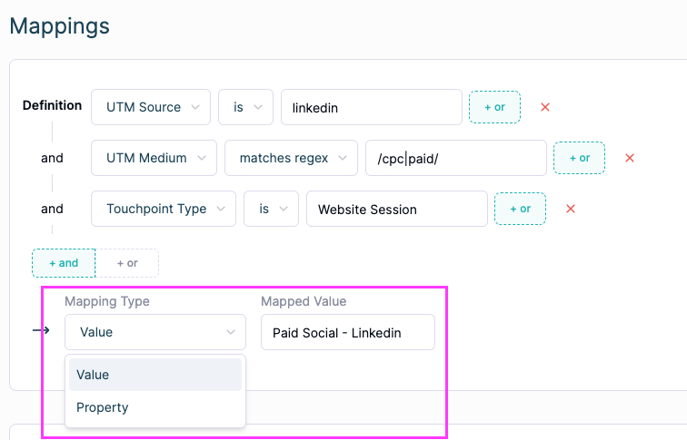

# How to: Build a Unified Campaign Property

The Unified Campaigns property is built on the back of the Unified Channel Property to give you the campaign metadata for deeper analysis. When you think to yourself: “Okay… email is getting all the attribution credit, but which email campaigns are the strongest?” This is the perfect time to employ the Unified Campaign Property. 

We will be assigning each campaign to a ***mapping type*** of ‘property’, and using different **mapping values**. The reason we use different mapping values is to allow cleaner/more detailed text to be shown within the reporting we will be pulling these values into. The most generic value would be UTM Campaign (and you could use these), however, the more readable and recommended approach to pull these in would be to follow the instructions below.

1. Duplicate Unified Channel
2. Change all channels that have campaigns' mapping type from “Value” to “Property”
    
    
    
3. Property Mapped Values by Channel
    1. LinkedIn ads with website session gets mapped to Ad Group
    2. Google Ads, facebook ads, other ads channels get mapped to Campaign or UTM Campaign
    3. LinkedIn ads impressions, engagements,(data from the Ad Integration directly) gets mapped to linkedin_campaign_name
    4. Salesforce campaigns get mapped to campaign_name
    5. Marketo data gets mapped to marketo_program_name
    6. Hubspot email campaigns get mapped to email_campaign_name
    7.  Any other website session gets mapped to UTM Campaign.
4. Delete all mappings that do not have campaigns