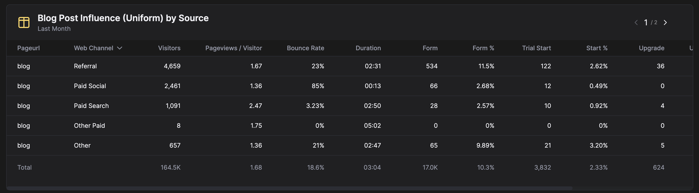
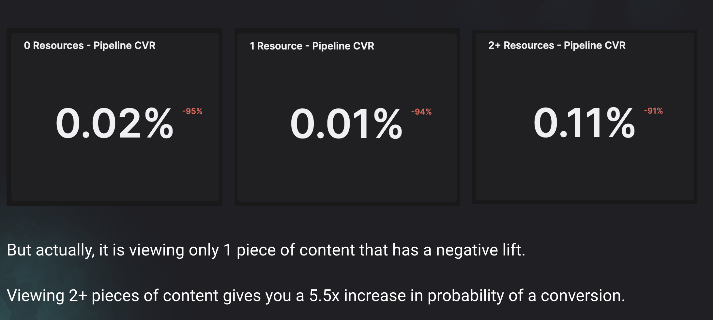
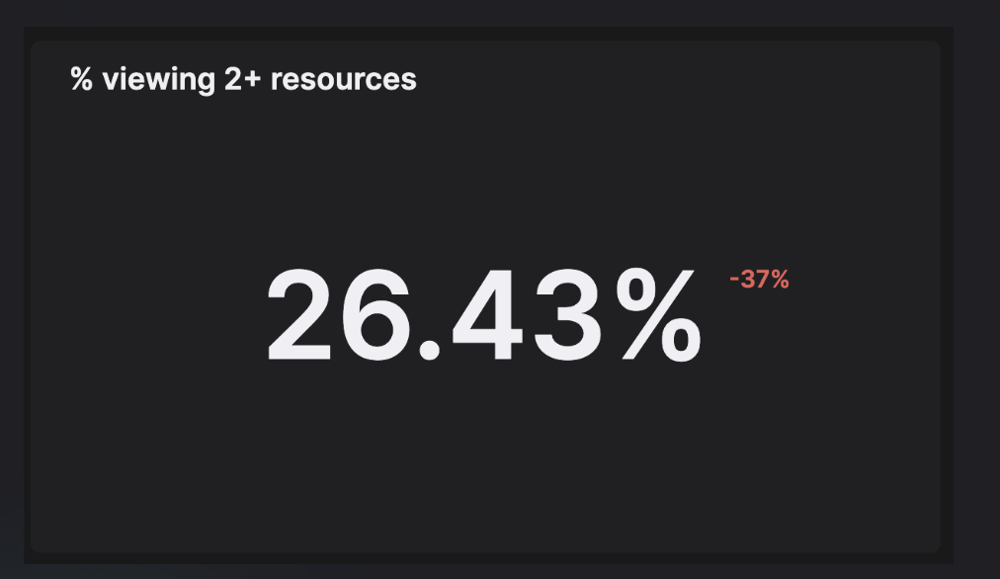
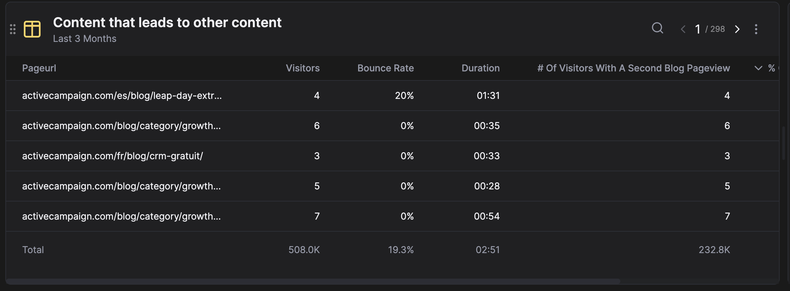
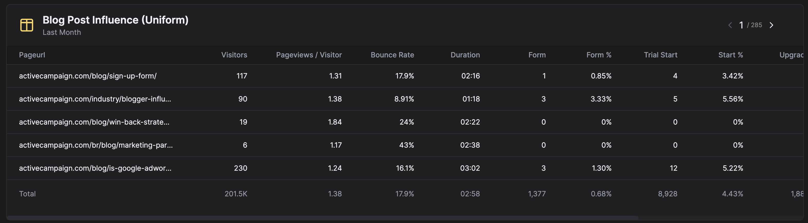
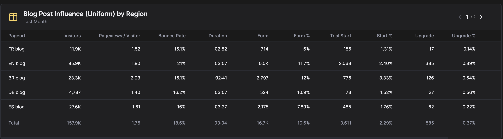
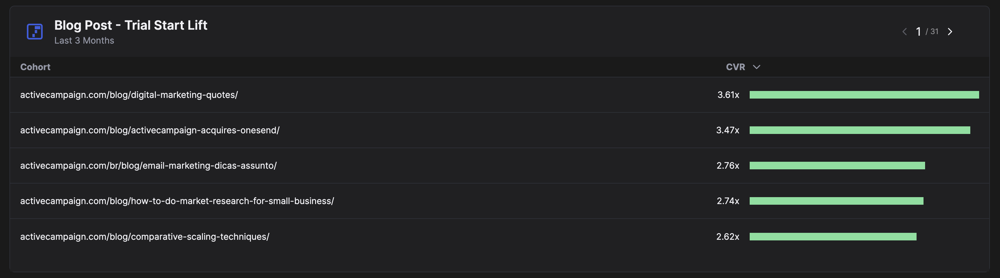

# -

# 102 - Special Types of Reporting

- Conversion rates & cohorted reporting
    
    
- LinkedIn Ads integration
    
    
- Salesforce integration
- HubSpot integration
- Website tracking
- Salesforce campaign and Marketo program reporting
- Special tracking features
    - Date properties
    - Touchpoint properties
    - What happens when you add a new field on your CRM
    - Updated actions
    - History tracking

# 103 - Rolling out HockeyStack for your company

WIP — Enablement for the champion

# 201 - Strategies using HockeyStack for Marketing

- **Ways to measure “influence”**
    - Method 1- Absolute influence
        - Total number of paid influenced Opportunities
            - Create number report
            - Sequence of “paid touchpoints” → “deal created”
            - Click Preview
        - Measures if there was any paid touchpoint before Opportunity stage
        - Imagine you have two reports, one showing paid influenced opps and one showing organic influenced opps. Imagine you have one opportunity that had both a paid and organic touchpoint before opp creation. Both reports would show 1 opportunity!!!!!
        - One good metric is the % influence.
            - The same report, divide by total deal created and preview
            - “This shows the % of total opps that are paid influenced. It’s also good to track this over time”
            - Convert to a line chart.
            - “Remember back to 101. Line charts are inherently broken down by Date. In our sequence we want the breakdown to be on deal created so that we stamp that date on the line chart instead of the paid touchpoint date.”
            - Change sequence breakdown to opp created and preview
    - credited attribution models: linear
        - Credited attribution models are the most common way of measuring influence.
        - Imagine you have 1 opportunity worth $100k, which has 10 touchpoints before opportunity created. A credited attribution model would credit a part of the $100k deal value to each touchpoint. For ex: a position based model would say the first touchpoint has a $40k value. Or a linear model would say each touchpoint has $10k value. In every case, the total credit assigned to each touchpoint would total up to $100k.
        - To build this report we need to decide on what a touchpoint is. To keep it simple I will use UTM Source as breakdown. This will ensure only sessions that have a UTM Source are counted in attribution. No other session or marketing activity will get credit.
            - Create table report
            - Select UTM Source breakdown
            - Select Deal Created - times done - Linear attribution
            - Preview
    - Uniform attribution and lift report
        - [Still on the same table as previous one] There is also Uniform attribution. Uniform is similar to “absolute influence” where we are looking at whether or not there was a touchpoint in the journey. If I have 1 opp of $100k value with 10 *distinct* touchpoints, each touchpoint will get $100k credit. Total credited amount will be $1M. If I have 10 linkedin touchpoints, linkedin will get $100k credit. So it is a measure of whether or not touchpoint exists in the journey, regardless of its frequency.
        - Change model to Uniform.
        - The most popular touchpoints will be at the top of the table but to make this more insightful we also need a measure of how influential the touchpoint actually is.
        - That measure is the lift report. You can refer back to the lift report guide to learn more. Lift, paired with Uniform attribution will show the influence of each touchpoint. High lift, high attribution touchpoints will be the most influential and vice versa.
        - On a separate tab build a lift report
            - model cohorts = properties > utm source
            - definition = (sequence of view any page > deal created divided by view any page)
    - Influence for outbound vs inbound
        - A common use case is to track marketing influence on outbound deals as CRMs usually mark an opp as Outbound and marketing’s influence goes unnoticed
        - To do this we can change our KPIs . Instead of using Opportunity goal, you can create an Outbound Opportunity goal.
        - Go to Goals
        - Create new goal → Deal Created → + property → deal_source = Outbound.
- **Ways to optimize content marketing**
    - Optimizing content marketing first comes from understanding the goalpost
    - Level 1 - Many marketing orgs optimize for content traffic and magically expect conversions
        - Still, content traffic is important to track so let’s build this report.
        - Create Goal → View Any Content.
            - Make sure you include contains /blog OR contains /somethingelse (like academy)
        - Create new dashboard called “Content”
        - Create Report → line chart of View Any Content - Times Done - last 6 months → Preview
    - Level 2 - Many more developed marketing orgs optimize for qualified traffic — i.e. set a bounce rate or page duration target and anything below that does not matter.
        - Add new line on the linechart, add View Any Content - Times Done, click + Filter to add a column filter, filter to page count > 1 or page duration > 10. Call it Engaged Content Views → Preview
        - Save report
        - Then we can look at % of qualified traffic
        - Duplicate report,divide second column by the first column to get % qualified traffic, and then remove the first column so that the line is only showing the %.
        - **Insight 1: This number has to go up over time unless you are blitzscaling your blog traffic, which many of you are not.**
    - Level 2.5 -  Most marketing orgs use organic search as their only source for content traffic, but that doesn’t have to be the case.
        
        
        
        - It’s good to experiment with paid as a way of distributing bofu content —
            - You can try it and track performance on this report. If you are getting a good visitor → pipeline %, you should continue, of course given that the campaign isn’t completely setting money on fire.
                - You can also add spend to this table.
            - If you remove the grouping on pageurl, it will show all blog posts. Which you can use to understand pages that work well with paid vs should remain as organic.
    - Level 3- Understanding that content works best in correlation with the number of consumptions
        - To understand that we will look at pipeline cvrs
            
            
            
            Bu raporlar seonda var Bugra diye aratırsan reportsta
            
        - The % of content visitors who have viewed a second piece of content is
            
            
            
            Bu rapor seonda var Bugra diye aratırsan reportsta
            
        - If you were to increase this from 25 to 30, and you have 1000 visitors a month, with a conversion rate to pipeline of 10%, in any given month you will get 50  visitors who visit 2+ resources (1000 * (30%-25%)), and they will convert into 5 (1000 * 5% = 50. 50 * 10% = 5.) incremental opportunities. **Insight 1: % viewing 2+ resources**
        - Now we can create a report showing which pieces of content are correlated with a second visit.
            
            
            
            Activecampaignde var
            
            - Sort by visitors descending and look at % of visitors with a second blog pageview.
                - If you encounter one that is really high above the average (average is at the bottom of the table), then you should drive as much traffic to that page as you can, or you should try to replicate that same page for another category. **Insight 1: If this page has a medium amount of traffic, this is a really easy lever.**
                - If you encounter one that is really low below the average, then you should look at why.
                    - First culprit, look at bounce rate and duration on the table. Is both worse than average. **Insight 2: Then your content is bad.**
                    - Second culprit, go to the page and look at internal linking. **Insight 3: If you don’t have any links, adding them would be a decent lift.**
                    - Third culprit, go to 5 of the top pages by % of visitors with a second blog pageview, and with high number of visitors and try to find patterns. One pattern we found with a customer is that for all the top 5 pages, they had a really beautiful callout in relevant areas of the page where they would forward to a useful piece of content. Or another one is that the top 5 pages centered around 2 very specific topics. **Insight 4: Pattern**
    - Level 4 - Actually tying content to pipeline
        
        
        
        activecampaignde var
        
        - Do uniform attribution with pages
        - Otherwise if you do linear, it will be weighted towards homepage and product pages, because everyone that buys software will necessarily go to those pages. Uniform will ensure everything is weighted more equally without the frequency distorting the values.
        - To get to an insight, you should always look for inconsistencies. High ACV but low visitors? High visitors but high bounce rate? High visitors, low bounce rate, high duration, but low ARR contribution? **Insight 1: These will give you an idea of what next to write and what next to optimize.**
        - You should also group blogs wherever possible in attribution. You can group by category, language, length, etc.
            
            
            
            activecampaignde var
            
        - Whenever you use uniform remember to do a lift report. Linear inherently measures the level of influence of the touchpoint but uniform doesn’t have that measure so you should supplement with lift.
            - You first have to create a defined propert.
            - Go to Definitions > Properties > Create New
            - Check ActiveCampaign example
            - Go back to reports, select lift
            - Build report below
            
            
            
            activecampaignde var
            
- **Ways to optimize paid advertising**
    
    
- Ways to optimize email marketing
- Ways to optimize offline events
- Ways to optimize website performance

# 202 - Strategies using HockeyStack for ABM

// include account list upload