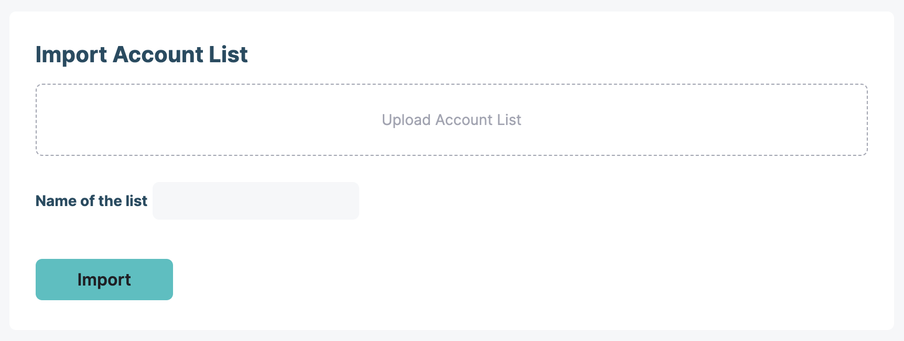
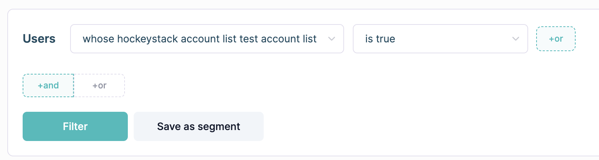
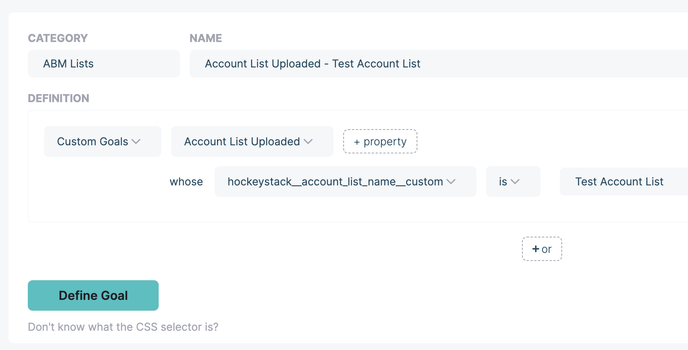

# Account List Import

HockeyStack allows you to import a CSV of companies into the system to use in your reporting. To import an account list, navigate to [Settings > Reporting & Tracking](https://hockeystack.com/dashboard/settings?tab=1).

Requirements for the uploaded CSV:

- Can have a maximum of 100k rows
- The first row should include headers. The headers to include are:
    - company_domain
        - Example: hockeystack.com. No https or any additional characters.
    - date
        - This field is optional.
        - Formatted as YYYY-MM-DD
- There should be no empty rows in the data, or no invalid pieces of data

When the list is imported, HockeyStack will create an action in each company’s journey with the below structure:

- **Action Name:** Account List Uploaded
- **Date:** Either the supplied date column in the account’s row in the CSV, or the date of the upload if there is no date supplied.
- **Action Properties:**
    - **hockeystack__account_list_name__custom:** *<Account List Name>*
- **Company Properties:**
    - **hockeystack__account_list__*<Account List Name>*:** true

Then, you can either use the company property in your filters like below:

Or, you can create a goal with it:

# Use Cases

- ABM Lists
- Tracking actions that are not date-stamped in CRM (E.g. event attendance in HubSpot)
- Tracking actions that don’t exist in a connected system (E.g. PLG Signups)