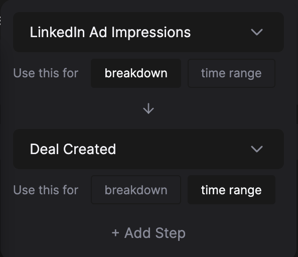
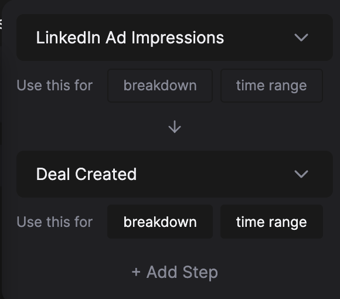

# Attribution Models

When building an attribution report, you have the below attribution models to choose from. 

This guide will illustrate all models using the example: 
*Google Ads Touchpoint → Facebook Ads Touchpoint → Google Ads Touchpoint → SDR Touchpoint → Opportunity Created ($10k)*

- **First Touch:** All value is assigned to the first touch.
    
    Example above:
    
    - Google Ads - $10k - 1 opportunity
- **Last Touch:** All value is assigned to the last touch.
    
    Example above:
    
    - SDR - $10k - 1 opportunity
- **Linear:** The total value is divided and distributed equally among all touches.
    
    Example above:
    
    - Google Ads - $5k - 0.5 opportunites
    - Facebook Ads - $2.5k - 0.25 opportunites
    - SDR - $2.5k - 0.25 opportunites
- **Position-Based:** The first and last touches get 40% of the total value each, and the remaining 20% is distributed among the remaining touches.
    
    Example above:
    
    - Google Ads - $5k - 0.5 opportunites
    - SDR - $4k - 0.4 opportunites
    - Facebook Ads - $1k - 0.1 opportunites
- **Uniform:** The total value is assigned to each touch.
    
    Example above:
    
    - Google Ads - $10k - 1 opportunity
    - SDR - $10k - 1 opportunity
    - Facebook Ads - $10k - 1 opportunity
    
    Note: The total attributed value doesn’t add up to the total actual value when using the Uniform attribution model.
    
- **Time Decay:** The time decay model is another model where the total value attributed doesn’t add up to the total actual value. It is designed to attribute less value to a touchpoint the further away it’s from the conversion action. Specifically, the value halves every 7 days.
    
    For fellow nerds, the formula is $v \times 2^{-{i\over7}}$ (where $v$ is total value and $i$ is days from the conversion action).
    
    Note: The total attributed value doesn’t add up to the total actual value when using the Time Decay attribution model.
    
- **Predictive:** HockeyStack’s proprietary machine learning attribution model.

## When to use Linear vs Uniform

Linear is a credited attribution model. It’s used to signify a comparison between the level of influence that each touchpoint has on the final conversion action.

Uniform is not a credited attribution model. It’s used to signify that the influence exists, regardless of its level. 

Uniform is most commonly used when looking at:

- Deal amount metrics like ACV, where you need to calculate using the full deal amount, rather than the credited amount.
- The most popular touchpoints before a certain conversion action.

## What touchpoints are included in attribution?

“Qualified touchpoints” depend on the report breakdown you select.

- If you only select web source-related breakdowns such as Source, Campaign, or UTM medium, only web sources will be included as attribution touchpoints.
- If you only select page url as the breakdown, only pageviews will be included as attribution touchpoints.
- If you select any action property as the breakdown, actions that have that action property will be included as attribution touchpoints. 
Ex: If you select linkedin_campaign_name, the only attribution touchpoints will be linkedin ad impressions/engagements. But if you select action type, since all actions have an action type, everything ever recorded will be attribution touchpoints.
- If you select a defined property as the breakdown, similar rules to the above apply, based on the mapped properties used in the defined property. However, if the defined property has “Hide values outside mappings” selected, hidden values will not be included as attribution touchpoints.
- If you select multiple breakdowns, the broadest possible touchpoint range, based on the above rules, will be included as attribution touchpoints.

If using a goal, all “qualified touchpoints” before the first instance of goal in a user/company’s journey within the selected date range are used as touchpoints.

As an example, think of a journey that has a Google Ads visit 3 months ago, a conversion 2 months ago, a Facebook Ads visit yesterday, and a conversion today. If the report date range is This Month, the Facebook Ads visit will be used in attribution, with the conversion today. If the report date range is Last 3 Months, the Google Ads visit will be the **only touchpoint** used in attribution, with the conversion 2 months ago. The Facebook Ads visit and the conversion today will be disregarded.

If using a sequence, all “qualified touchpoints” before the first instance of the “breakdown” selected sequence step within the selected date range are used as touchpoints.

All touchpoints before the first Linkedin Ad Impression.

All touchpoints before the first Deal Created after any LinkedIn Ad Impression.