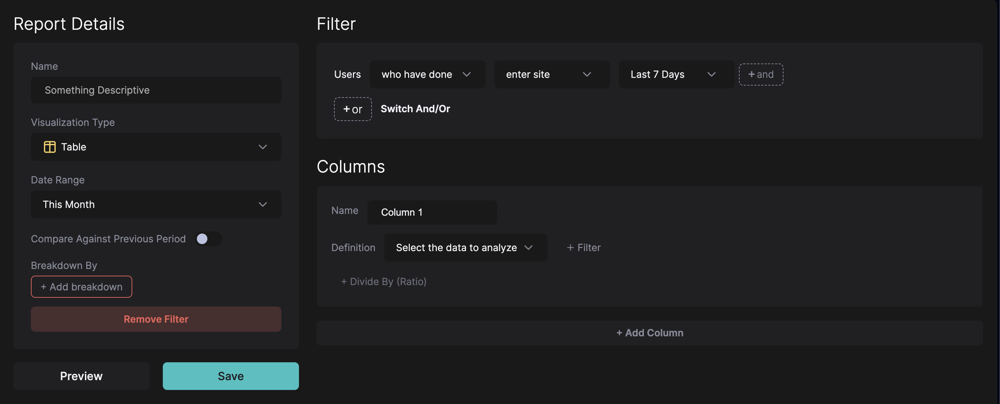

# Building a Basic Report

In HockeyStack, navigate to [Definitions > Reports](https://hockeystack.com/dashboard/reports/?utm_source=hockeystack_academy).

This page is your dictionary of reports.

You can click on the + icon on the top right corner to create a new report.

---

Basic reports are:

- a set of numbers
- broken down by a property,
- and optionally, filtered to show a certain segment

The reporting screen is organized in this format.

- Your numbers will be defined on the right side where it says “Columns”
- “Breakdown” is where you configure which property to break the numbers down by
- And the top level Filter defines the segment of users or companies that the report is filtered to.

Report Details also houses some additional configuration details on each report type.

# How to think about building reports

HockeyStack beginners usually struggle with building reports because they jump right into creating the report without thinking about what the report will look like.

Our suggestion to all HockeyStack users is to very specifically define the three main pieces of a report before starting to create it.

For example, if I want to create a report that shows pageviews to each page coming from outside the US, my report will have:

- **Numbers:** Pageviews
- **Breakdown:** Page URLs
- **Filter:** Country is not US

Then, creating the report is just a matter of finding the right dropdown and selecting the right option, which is easier than thinking about what the report will look like.

Even more often than the above, HockeyStack beginners try to build a report without knowing what data the report will show. For example, a question you have in your mind might be “What products and content is our non-US audience interested in?” If you land on the reporting page with this question in mind, your first job is to think about “What datapoint(s) and what type of report(s) would help me answer this question?” If you don’t run through this exercise before building a report, you will not be able to answer your question.

To sum up,

1. Think of a specific question you want to answer
2. Figure out **exactly** what the report and the data to answer that question will look like
3. Figure out the:
    1. Numbers
    2. Breakdown
    3. Filter
4. **Finally, land on the HockeyStack dashboard to build the report.**

As you can see, most of the work in analyzing your marketing must be done before you land on the reporting screen. The rest of the reporting documentation will focus on the 4th step. 

# Navigating the reporting screen

Let’s continue with our example: a report that shows pageviews to each page coming from outside the US

- **Numbers:** Pageviews
- **Breakdown:** Page URLs
- **Filter:** Country is not US

[https://app.arcade.software/share/V2XknEroWjKkQgOFded8](https://app.arcade.software/share/V2XknEroWjKkQgOFded8)

This report demonstrates a couple **very important** concepts about reports in HockeyStack.

The **numbers** in the report are pulled from actions. In this case, the Pageview data refers to the total number of actions with `action_type = enter-page` .

The **breakdown,** breaks down the actions in the report by their properties. In this case, we selected Page URL. So each action with `action_type = enter-page` is broken down into their `page_url` properties. 

The **date range** we selected refers to the timestamp of the actions. In this case, we are counting the pageviews that happened within This Quarter.

The **report-level filter** is used to filter **users and companies that are considered in the report. This is a commonly confused point.** The report-level filter is only used for user and company properties, and user and company behaviors. ****The report level filter would not filter, for example, the pages that are in the report. Because pages/pageviews are related to actions. If I were to create a filter that says “User has done Homepage View”, this would find the visitors who have had a homepage visit, and would still show all the other pages they visited in this report! I’m also specifying that this is the “report-level” filter, because there are other filter types with different behaviors.