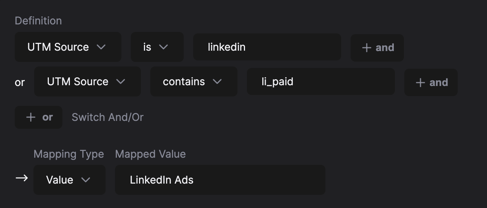

# The Marketer’s Guide to AND / OR

AND / OR logic can be quite unfamiliar for most marketers, but it’s crucial to be able to create the correct filters in HockeyStack.

AND is used when the conditions in the statement need to be true. For instance, if you want to filter for users who are from Canada AND have made a purchase, both conditions must be met for the user to be included in the filter.

OR is used when at least one of the conditions needs to be true. If you want to filter for users who are either from Canada OR have made a purchase, the user will be included in the filter if they meet either one of these conditions.

Let’s think of a person called Michael Scott, who’s from the US and have made a purchase.

Let’s say we want to create a filter that says that a user is from North America, meaning they have to be either from Canada or from US.

The logic is: “User is from Canada OR User is from US”. In the case of Michael,

- User is from Canada = FALSE
- User is from US = TRUE

OR logic is used, meaning only one of them have to be true for the entire statement to be true. Therefore, Michael matches our filter, and is deemed to be from North America.

Now, a more complex example is if we want to create a filter that says a user is NOT from North America.

**Most marketers get this part wrong.**

Your natural instinct would be to say “User is NOT from Canada OR User is NOT from US”. In the case of Michael,

- User is NOT from Canada = TRUE
- User is NOT from US = FALSE

OR logic is used, meaning only one of them have to be true for the entire statement to be true. Therefore, Michael matches our filter, and is deemed to be NOT from North America! That is incorrect.

So in this case, the correct filter is: User is NOT from Canada AND User is NOT from US.

When AND logic is used, both statements have to be TRUE for the overall statement to be TRUE. Therefore Michael will not match this Non-North America filter, which is our expected behavior.

---

A lot of times, in HockeyStack, you will start building a filter with a top-level OR block, and then want to switch the top level block to AND.

Example: We want to create a defined property for LinkedIn Ads visits. We start by defining our UTM Sources.

Now, you want to specify that the Touchpoint Type for both should be Website Session. You have two ways of doing this.

1. Directly add it under the bottom level AND
    
    
    
2. You can “Switch And/Or”, and add it at the top level. This is the more scalable solution. If you were to add another OR block on Option 1, you would have to add 2 filters, vs. only 1 filter with the below approach.
    
    