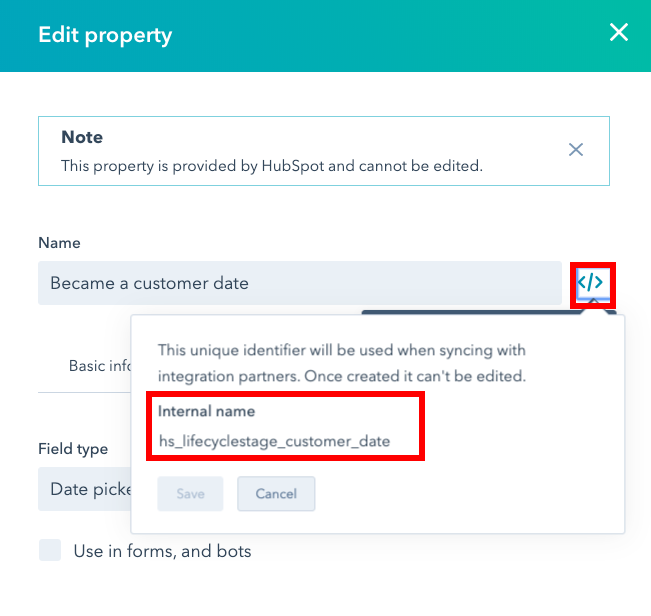

# Finding Internal Field Names in HubSpot

1. Click gear icon on the header
2. Select Properties from the left menu
3. Click on the field you need the internal name for
4. Click the </> icon
    
    