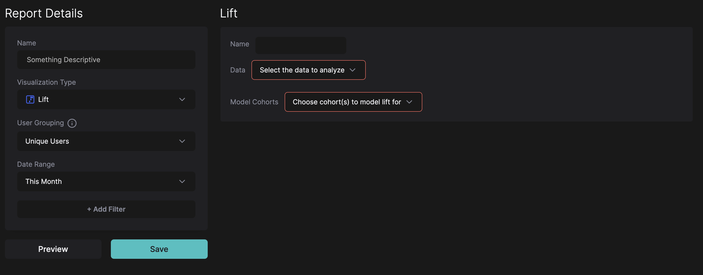

# Lift Reports

Lift Reports are a measure of an action’s or a property’s incremental impact on a conversion rate.

Example: the incremental impact of an ad click on a demo conversion.

“Incremental” means that the conversion wouldn’t have happened without the action. Of course, there is no real way to know that, as the human psyche is complex and unpredictable. But on a large enough audience, if we measured lift, we would be very close to real incrementality.

Let’s say we measure the conversion rate of website visits → demo conversions as 20% when there is an ad click before the website visit, and as 10% when there is no ad click before the website visit.

In this case, our lift is (20 - 10) / 10 = 1x.

Now, let’s say there were 100 ad clicks, with $1000 in spend. That means we got 20 demo conversions after ad clicks. Let’s say 1 of those turned into a Closed Won opportunity, with a value of $3k, so our ads are returning 3x ROAS.

If we increased the ad spend to $2000 and got 200 ad clicks in this scenario, assume we would generate $3k in additional revenue. If we didn’t increase the ad spend, and still got a similar amount of traffic from another source, the lift report predicts that we would generate only $1.5k in additional revenue with 15 demo conversions.

Now, if the lift was reduced to 0, the lift report predicts that it doesn’t matter that you spend the extra $1000 on your ads or get traffic from another channel; you will generate the same amount of revenue regardless.

## Defining Lift Reports in HockeyStack

First let’s set our terminology:

- **Cohort:** The group of individuals/companies who have done a certain action or has a certain property that we’re measuring lift on.
- **Anti-cohort**: The group of individuals/companies who have not done a certain action or doesn’t have the property that we’re measuring lift on.

If you select the Lift report type when creating a new report, you will be met with the following screen:

Here, Model Cohorts is asking you to choose a way to create the cohort and the anti-Cohort.

You can choose a Goal (or multiple), a Property, or a Segment.

- If you select a goal, the cohort and the anti-cohort will be based on performing that goal vs not performing that goal in the journey towards the conversion. You can select multiple goals in a single lift report to compare their lift side-by-side.
- If you select a property, all values of the property will be used to create separate cohorts and anti-cohorts. For example, if you select UTM Source, the report will calculate lift for every UTM Source (cohort based on whether or not someone visited from that source). You can also choose user or company properties like Contact Source or Company Industry.
- If you select a segment, the cohort will be everyone in the segment, and the anti-cohort will be everyone outside the segment.

Data is asking you for the conversion rate the report should measure on both the cohort and the anti-cohort.

## Best Practices

- Your cohort and your anti-cohort has to be of significant sizes; otherwise the lift will not be an accurate number.
- Your conversion action should be done by enough individuals/companies; otherwise the lift will not be an accurate number.
- When defining a conversion rate, you need to make sure that both conversion rates are similar to each other; otherwise the lift will not be an accurate number.
    
    To visualize this, imagine you’re measuring LinkedIn Ads impressions’ impact on the Any action → Deal Created conversion rate.
    
    The cohort data is LinkedIn Ads Impressed Companies → Deal Created, divided by LinkedIn Ads Impressed Companies.
    
    The anti-cohort data is Deal Created, divided by any company who has had any action.
    
    If you don’t store your entire TAM in your CRM, chances are, the LinkedIn Impressed cohort is significantly larger than the anti-cohort of “companies who have had any action”. 
    
    In this case, you’re comparing the division of a small number by a really large number (LinkedIn impressed conversion rate), and a small number by a small number (non-LinkedIn-impressed conversion rate). This will almost always yield a negative lift.
    
    The correct way to define this is to find an action before Deal Created that both cohorts should have done a similar amount of. An example is website visits.
    
    If your conversion rate is Website Visits → Deal Created, divided by Website Visits, we would get very similar sizes for both the cohort and the anti-cohort, and the lift would be more accurate.
    

## The marketing sequencing use case

Apart from the obvious use case of knowing where to invest your next piece of budget in, the lift report can also tell you where in the customer journey it’s best to introduce a certain touchpoint.

To do this, create a lift report for all stages of your buyer journey, for all possible touchpoints.

Let’s say your buyer journey is Website Visit → MQL → SQL → Closed Won. And let’s say we’re modeling blog pageviews as the cohort.

You would have a Visit → MQL lift report, an MQL → SQL lift report, and an SQL → Closed Won lift report.

If the Visit → MQL lift is positive, you would want to invest more in TOFU SEO and broad reach content ads to capture a high amount of eyeballs on your blogs very early on in the buying journey.

If the MQL → SQL lift is positive, you would want to invest more in BOFU SEO and ads, and email campaigns to capture high-intent eyeballs on your blogs.

And if the SQL → Closed Won lift is positive, you would want your sales reps to introduce blog posts during the sales cycle to increase win rates.