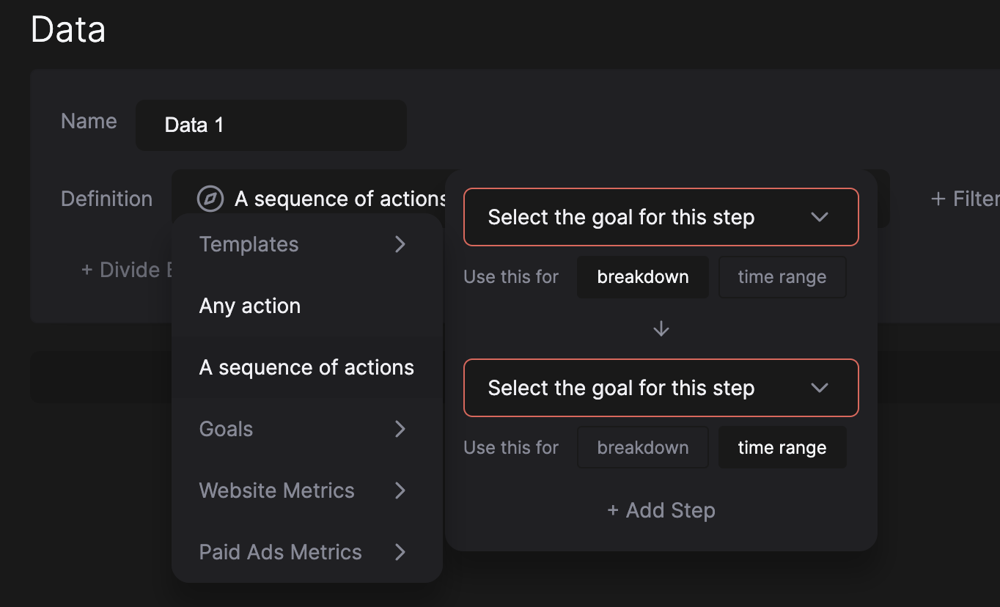
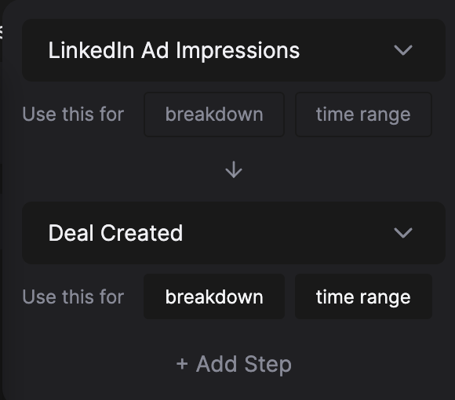
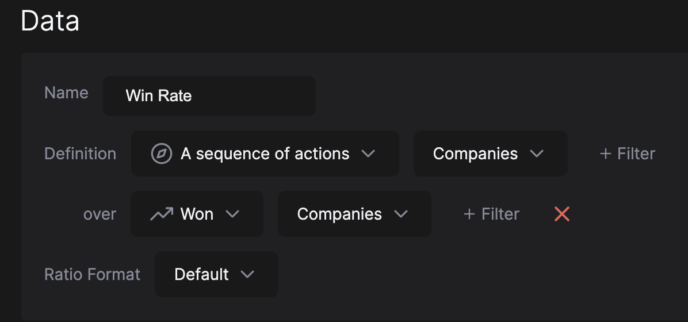
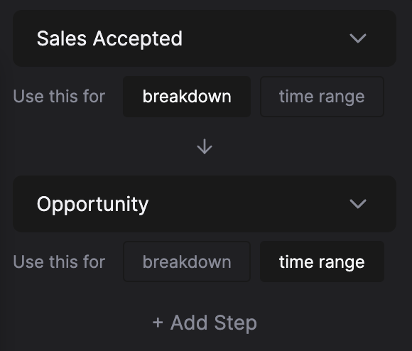
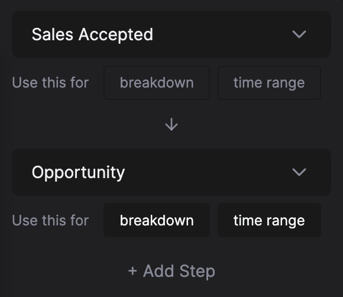

# Sequences

Using sequences in reports allows you to be even more flexible with how you define the data in your reports.

To start, click on “A sequence of actions”.

Here, we have 3 options:

- Adding & changing steps on the sequence
- Changing the breakdown step
- Changing the time range step(s)

## Steps on the sequence

Whichever step you select on the sequence, HockeyStack will try to find the first possible action that fits the sequence. Imagine the below journey:

(1) LinkedIn Ads Visit → (2) Google Ads Visit → (3) LinkedIn Ads Visit → (4) Deal Created → (5) Google Ads Visit → (6) Deal Created

If you selected a sequence of LinkedIn Ads Visit → Google Ads Visit → Deal Created, actions 1, 2, and 4 would be selected (provided it fits the time range, which we get to later in this guide).

Whether or not actions are grouped at the individual or the company level depends on what metric you select.

If you select Unique Users, actions will be grouped at the individual level. If you select Companies, actions will be grouped at the company level (meaning if the actions in the sequence came from different individuals, it will still count in the sequence), and actions that are not tied to a company will be disregarded. If you select any other option, actions will be grouped at the company level if possible, but actions that are not tied to a company will still be grouped at the individual level.

Note: “Tied to a company” in this case is not related to the company-contact associations in your CRM. HockeyStack has different methods for tying every possible related contact to a company. An example is, if a Lead in Salesforce has a business email that matches the domain of an Account, it will be tied to the company in HockeyStack.

## Breakdown step

You are required to select a single breakdown step for every sequence. This is, by default, the first step. 

The breakdown step is used to understand which action should be used as the breakdown for that datapoint. 

Imagine a sequence of LinkedIn Ad Impressions → Deal Created, with the report breakdown being Date. In this case, if we selected LinkedIn Ad Impressions as the breakdown step, the data would be tied to the Date of the LinkedIn Ad Impressions. And if we selected Deal Created as the breakdown step, it would be tied to the Date of Deal Created.

<aside>
💡 In a line chart, the breakdown is inherently selected as “Date”, so you should always be mindful of which breakdown step you select when using a sequence in a line chart.

</aside>

For attribution, since the breakdown determines what attribution touchpoints there will be, the sequence breakdown step also determines what attribution touchpoints there will be. Only touchpoints before the selected breakdown step will be included.

All touchpoints before the first Linkedin Ad Impression.

All touchpoints before the first Deal Created after any LinkedIn Ad Impression.

## Time range step(s)

You are required to select at least one time range step for every sequence, but you can also select multiple. This is, by default, the last step. The selected step(s) influence which step will be filtered by the report date range.

## Metric to analyze

The metric dropdown applies to the last step of the sequence.

## Filter

The filter next to the metric dropdown applies to the last step of the sequence.

# Common Use Cases

## Influence

Sequences can be used to create reports of “X-Influenced Y”. For example, to create a report of “Blog Influenced MQLs”, you just have to create a sequence of Blog Visits → MQLs. This will capture all MQLs that had Blog Visits before converting.

## Conversion Rate

Conversion rates should use sequences. Very commonly, companies have complex buying stages with skippable steps. There may be SQLs that never were MQLs. In this case, if you were to create a conversion rate report from MQL → SQL, if you don’t use sequences, you’ll get MQL-skipped SQLs also included in your report.

All conversion rates should look like below:

## Velocity

If you want to measure the avg. time between two actions in a journey, you can use sequences with the metric “Time between first and last step”. This should be divided by the number of Companies that went through the sequence, to ensure we get the average and not the total.

The result will look like “months:days:hours:minutes:seconds” (Example: 4:28:11:30:02)

## Cohort Analysis

Cohort Analysis refers to the practice of separating all data into cohorts of individuals/companies and tracking the same metric for each cohort. In this case, cohort analysis refers to separating individuals/companies by the date they performed an action. 

To visualize more clearly, imagine a sequence of Sales Accepted Lead (SAL) → Opportunity, divided by the number of SALs. This signifies the conversion rate from SAL → Opportunity. 

If we were to put this on a line chart (which means our breakdown is Date), and selected SALs as our breakdown step, we would be looking at a report of “Cohorted SAL → Opportunity Conversion Rate”. This means, for each date range of the line chart, we would be looking at SALs in that date range, and the Opportunities created any time after that date range.

If, instead, we used Opportunity as our breakdown step, we would be looking at any Opportunity generated in a given date range, regardless of when the SAL happened. The SAL might be created 3 years ago, but it will be counted in the date range of when the Opportunity was generated. When you divide this by SALs, which will be in that same date range, you aren’t really looking at the conversion rate, but more so looking at the division of two unrelated numbers in a date range.

Cohorted approach (recommended)

Absolute number approach

The caveat to this, is that your numbers will skew lower at the later ends of a cohorted conversion rate report, because some of the conversions will not have happened yet. If you have a 4-month average sales cycle, for example, numbers for the last 4 months will be lower than the previous numbers.

## Lift

*Learn more about [Lift Reports](https://docs.hockeystack.com/data-visualization/lift-reports) before continuing.*

Sequences can be used both to create lift reports with the Lift report type, and to create lift reports manually using any other report type.

When using the Lift report type and defining your conversion rate, you need to use a sequence. (Refer to the “Conversion Rate” section above, and the [*Lift Reports](https://docs.hockeystack.com/data-visualization/lift-reports) doc*).

When using other report types to manually create lift reports, you need to prepend a step to the sequence signifying your cohort.

Let’s unpack that. 

The lift report models the impact of an action on a certain conversion rate. Let’s say the action is “LinkedIn Ad Visits” and the conversion rate is MQL → SQL. We call the users who have done LinkedIn Ad Visits our “cohort”, and the users who have not done LinkedIn Ad Visits our “anti-cohort”. Then, we draw the conversion rate in the cohort after the LinkedIn Ad Visit, and the conversion rate in the anti-cohort, and compare the two numbers. Here’s how you define both:

- **Cohort:** LinkedIn Ad Visits → MQL → SQL sequence, divided by the LinkedIn Ad Visits → MQL sequence. This shows the conversion rate from MQL → SQL when there is a LinkedIn Ad Visit prior to the MQL action.
- **Anti-cohort:** MQL → SQL sequence, divided by MQL, with a filter for “Users who have not done LinkedIn Ad Visits”. This shows the conversion rate from MQL → SQL when there isn’t a LinkedIn Ad Visit.

The Lift report type shows the number (Cohort conversion rate - Anti-cohort conversion rate) / Anti-cohort conversion rate as the lift percentage.