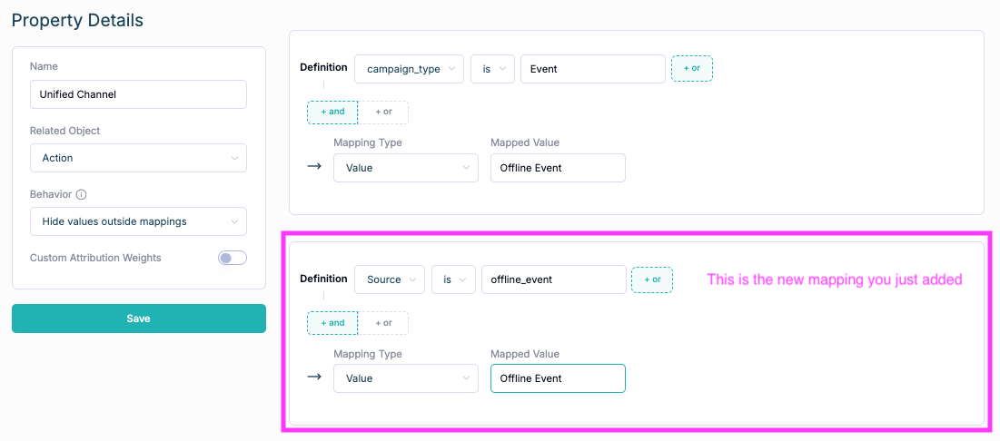
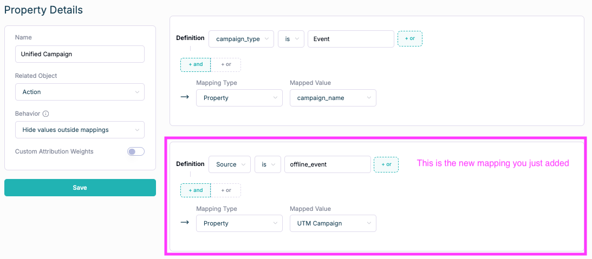
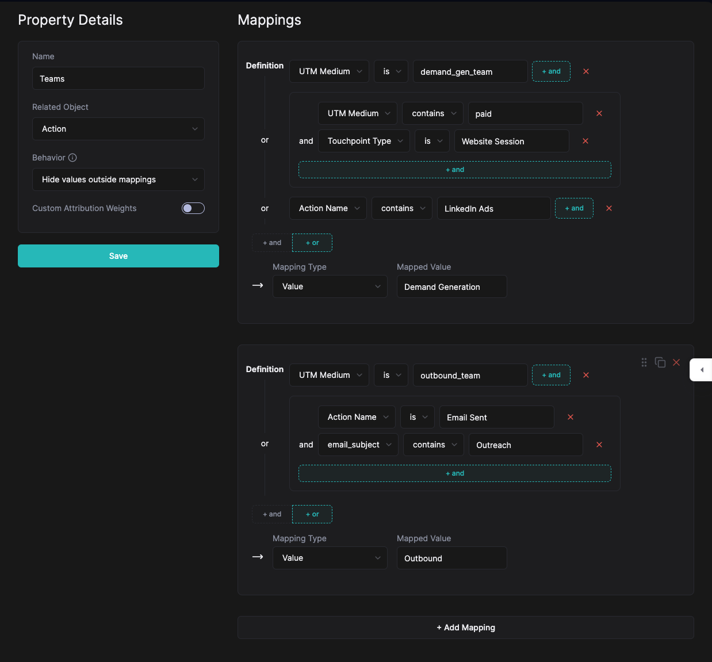
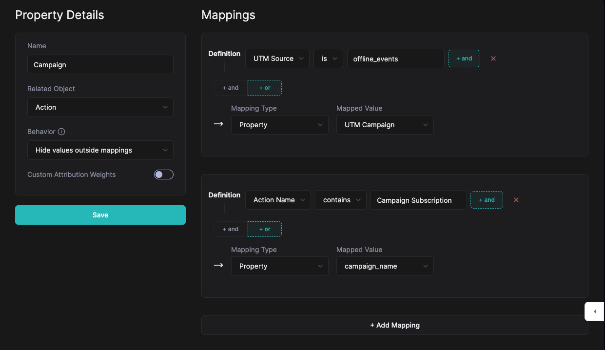

# Syncing spend from offline channels and campaigns

<aside>
👉 Pre-requisite Reading:

[Sync Spend](Sync-Spend.md)

</aside>

The spreadsheet-based Sync Spend functionality can also be applied to spend that may not be connected to a website visit.

Example:

- Headcount
- Events
- Webinars
- Partnerships
- Tooling

These types of costs are not tied to website visits, but are very important to track and include in ROI and CAC calculations. 

---

To do so, we first want to determine UTM parameters for each of the cost line items that we want to sync. 

As an example, if you wanted to sync Events, you might want to do something like below:

| utm_source | utm_campaign | cost |
| --- | --- | --- |
| offline_events | saastr_2024 | $9327 |
| offline_events | inbound_2024 | $10103 |

Or if you wanted to sync Tooling, you might want to do something like below:

| utm_source | utm_medium | utm_campaign | cost |
| --- | --- | --- | --- |
| marketing_tools | demand_gen_team | HockeyStack | $164271 |
| marketing_tools | outbound_team | Outreach | $129742 |

In any case, before getting started, we recommend taking stock of all types of costs you might want to sync and determining a UTM structure that has set meanings for each UTM parameter. The recommended structure is as follows:

- UTM Source = Broad Category
- UTM Medium = Associated Team
- UTM Campaign = Specific Line Item
    - Ex: campaign name, event name, tool name, etc.
    - If you will connect this to datapoints in other integrated platforms, you should use the same naming convention as other platforms
        - For example, if you have Salesforce Campaigns that you will be tracking spend for, you should add the full exact name of the Salesforce Campaign here.
- UTM Content = Line Items inside the specific line item (optional)
    - Ex: “asset design”, “agency retainer”, “booth expenses”

---

We also want to associate these line items with dates when the spend was made. How you want to do this depends on what reports you might want to create.

- If you will only be doing yearly reporting on blended costs, you can just enter the actual date when the spend happened
- If you will be doing monthly or weekly reporting on blended costs, ROI, CAC, you might want to divide an annual spend into equal monthly or weekly parts

The spend will only show up in reports where the time range includes the date that you insert the spend for.

---

After creating your UTM convention, deciding on a way to break down cost into dates, and [creating the spreadsheet(s) to sync, and syncing it into HockeyStack](Sync-Spend.md), you can move on to using the data in reports.

# How to use this in reports

To connect this spend data that has a “fake UTM” to the other datapoints in HockeyStack, you can use Defined Properties!

<aside>
👉 Pre-requisite Reading:

[Defined Properties](Defined-Properties.md)

</aside>

Since Defined Properties offer a way to group things together, it is the perfect way to group our spend data with other types of data.

## Beat Practice: Connecting Spend to Unified Channel and Unified Campaigns

Connecting your offline cost data to your Unified defined properties, is the best way to have you cost data across all department appear as “Ad Spend” does for your paid initiatives. 

**Connect the “fake” UTMs inside Unified Channel and Unified Campaign**

**Unified Channel:**

Add an additional mapping to capture spend for each offline channel your currently tracking and map accordingly.

**Unified Campaign:**

Add an additional mapping to capture spend for each offline channel your currently tracking and map accordingly.

Other Examples: Tracking Team Level Spend

We have the following spend data synced into HockeyStack:

| utm_source | utm_medium | utm_campaign | cost |
| --- | --- | --- | --- |
| marketing_tools | demand_gen_team | HockeyStack | $164271 |
| marketing_tools | outbound_team | Outreach | $129742 |
| headcount | outbound_team |  | $509472 |

We also have more spend items pulled from integrated ad platforms, under UTM Medium contains “paid”.

We also have non-spend items pulled from ad platforms and CRM that we want to track revenue from.

If we use this defined property in our reports, we will see both the spend items pulling in and the non-spend items being used for touchpoints!

## Example 2: Tracking SFDC Campaign Spend

We have the following spend data synced into HockeyStack:

| utm_source | utm_medium | utm_campaign | cost |
| --- | --- | --- | --- |
| offline_events | field_team | AMER_FY24_EV_SAASTR | $12083 |
| offline_events | field_team | AMER_FY24_EV_INBOUND | $10926 |
| offline_events | field_team | AMER_FY24_EV_HOCKEYSTACK_ROUNDTABLE | $5275 |

We also have the same utm_campaigns available in Salesforce as Campaign Names.

We can create a Campaign property like below:

In this case we are showing UTM Campaign as the property value when there is a UTM. We are showing Campaign Name if it is a Salesforce Campaign.

This is really cool, because if UTM Campaign and Campaign Name are the same, they will be displayed on a single row, and you will be able to create a single column that shows ROI!!