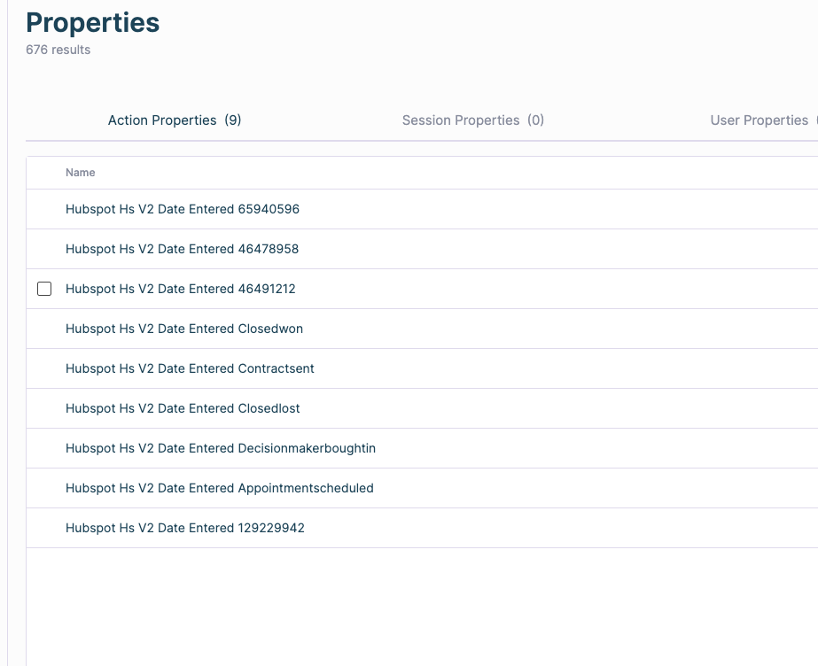
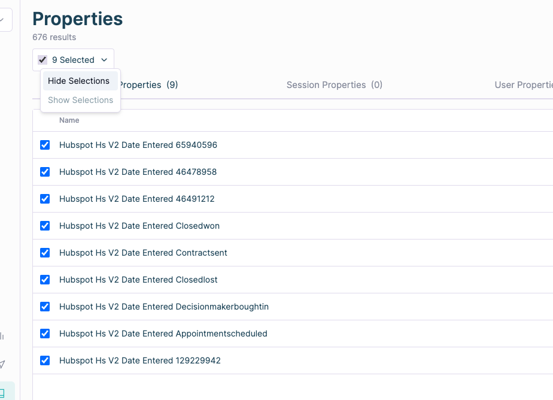

# Hiding / showing properties

HockeyStack pulls in all fields from all objects in your connected systems. This might become overwhelming for business users that are not very familiar with the inner workings of your CRM and marketing automation.

Therefore, HockeyStack offers a way to “hide” properties that will not be used in reporting.

Navigate to [Definitions > Properties](https://hockeystack.com/dashboard/properties).

This page displays a list of all of your existing properties and defined properties. You can hover over any of these properties and click on the checkbox next to it to select it.

Once you select all properties that you want to hide, click “Hide Selections”.

---

Once a property is hidden, it will not be shown in any filtering, definition, or reporting screens. Any report that already uses the property will not function properly.

This is not an irreversible operation. In fact, we keep collecting data about these fields, and you can re-show a property at any time to pull it into your reports without any resyncing required.