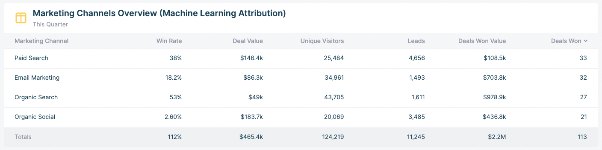

# Step 2.0 - Intro to your first attribution report

In step 2, you will be building your first channel attribution report.

To do this, we need to create:

- The definition of a “Marketing Channel”
- The definitions of your KPIs to add as columns to this report.

<aside>
❗ Read the below article on our data model before proceeding to [Step 2.1](Step-2-1-Organize-the-business-information-requi.md):

[The HockeyStack data model](../101-How-HockeyStack-Works/The-HockeyStack-data-model.md)

</aside>