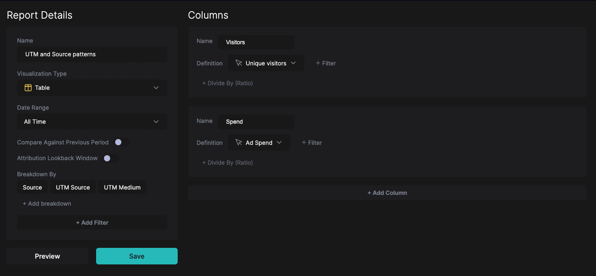

# Finding UTM and Source patterns in the website data

At times when you don’t know your exact UTM notation, or when your UTM notation wasn’t implemented properly, you might want to check the actual website data coming in.

1. Navigate to [Definitions > Reports](https://hockeystack.com/dashboard/reports) and click New Report on the top right.
2. Set up the below report, where:
    1. Columns are:
        1. Website Metrics > Unique Visitors
        2. Paid Ads Metrics > Ad Spend
    2. Breakdowns are:
        1. Source
        2. UTM Source
        3. UTM Medium
    3. Date range is All Times
    
    
    
3. Click Preview on the bottom left to see the data.
4. Search on the table for each ad platform that you have. For example, search for linkedin and take a look at the results. Take note of columns where the Spend value is 0 vs the spend value is populated. The columns where Spend is 0 might relate to organic social engagements, so they should be excluded.
    
    Take the below results as an example:
    
    | Source | UTM_Source | UTM_Medium | Unique Visitors | Spend |
    | --- | --- | --- | --- | --- |
    | linkedin_paid | linkedin_paid |  | 9041 | $48,900 |
    | linkedin_paid | linkedin | cpc | 498 | $10,200 |
    | linkedin | linkedin | social | 10,412 | $0 |
    | linkedin | social | linkedin_paid | 17 | $1,029 |
    
    In this case, for a group of UTMs to be considered a LinkedIn Paid visit, it must fit the following rules:
    
    - UTM_Source is “linkedin_paid”
    - or UTM_Medium is “linkedin_paid”
    - or (UTM_Source is “linkedin” and UTM_Medium is not “social”)
    
    If each row that has Spend >$0 fits the above ruleset, and each row that doesn’t have Spend is excluded from the above ruleset, then the ruleset is correct.
    
    Instead, many times, we see companies that have the above data thinking that LinkedIn Ads is always tagged with a UTM_Source of “linkedin_paid”. If you were to not follow this exercise and just tag UTM_Source is “linkedin_paid” as LinkedIn Ads data, you would be messing out on $11,229 in Spend and 515 visitors in your data.