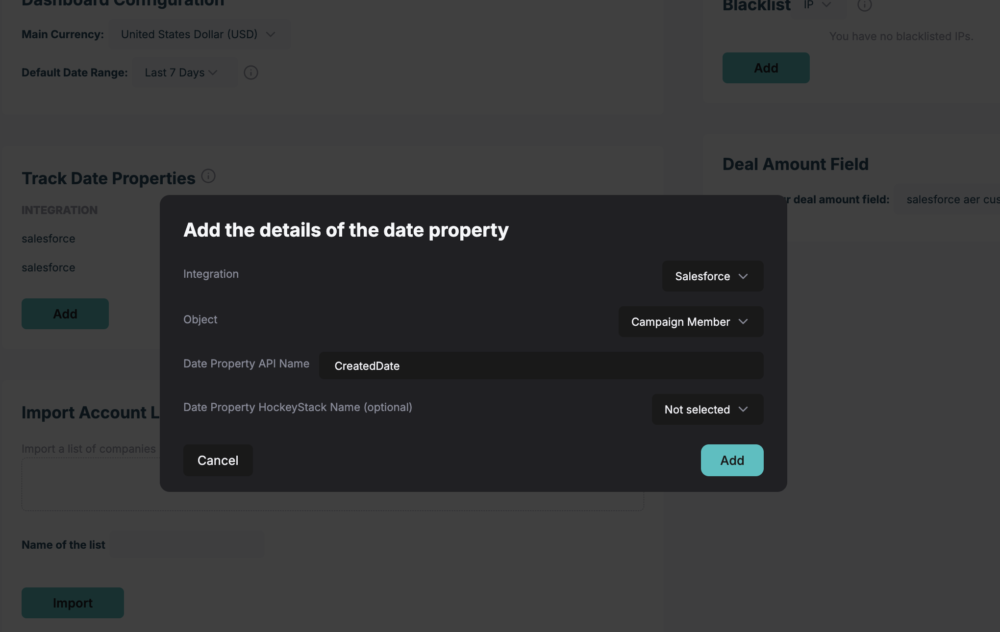

# Step 2.3 - Create your “Unified  Channel” property

<aside>
❗ Read the below guide on defined properties before proceeding:

[Defined Properties](../101-How-HockeyStack-Works/Defined-Properties.md)

</aside>

Before this step, you organized all information needed for your channel definition like below:

| **Channel Name** | **Tracking details** |
| --- | --- |
| Paid Search — Google Ads | - Website visit where utm_source = adwords
- Website visit where utm_medium = google_paid |
| Paid Social — LinkedIn Ads | - Website visit where utm_source = linkedin_paid
- LinkedIn Ads Ad Engagements
- LinkedIn Ads Video Completions |
| Organic Social | - Website visit where source is any of linkedin,facebook,reddit,quora,instagram,youtube,t.co |
| Organic Search | - Website visit where source is any of google,bing,yahoo,yandex,duckduckgo,ecosia |
| Email Marketing | - Integration = Marketo
- Action Name contains one of Open Email,Click Email
- Website visit where utm_medium **contains** email |
| Events | - Salesforce CampaignMember where Status is one of Attended, Responded, Scanned, Booth AND Campaign Name **contains** EVT- |
| Other Referral Traffic | Run through all the other rules, and if it doesn’t match any and Source is not direct and Source is not empty, count that as Referral traffic. |

Now, we will translate this into a defined property called “Unified Channel”, which will have each of the above rows as mappings inside it.

Navigate to [Definitions > Properties](https://hockeystack.com/dashboard/properties) and click + on the top right.

## Paid Search — Google Ads

[https://app.arcade.software/share/uOpQymHwY6iqycDyHaZu](https://app.arcade.software/share/uOpQymHwY6iqycDyHaZu)

**The HockeyStack data model is based on "actions" that prospects take along their journey to becoming a customer. "Actions" by definition have a specific timestamp.**

Whereas the CRM data model is based on "objects" and "fields" inside those objects. For example, you might have a Lead record, and that Lead record might have a Source field. The Source field does not have a timestamp, so is not convertible to "actions" in HockeyStack.

**Things that are convertible:**

- Any date field within any field
- Campaign memberships
- Tasks, activities, etc.
- Website data,
- Other integration data like LinkedIn Ads engagements

The commonality between all of the above is that we know what date and time these interactions happened, so we can place them on the account journey.

Read more about the data model here: [https://docs.hockeystack.com/hockeystack-academy/101-how-hockeystack-works/the-hockeystack-data-model](https://docs.hockeystack.com/hockeystack-academy/101-how-hockeystack-works/the-hockeystack-data-model)

Also this is a good resource for how HockeyStack works: [https://hockeystack.com/the-flow/episodes/hockeystack-webinar-office-hours-05-09-2024](https://hockeystack.com/the-flow/episodes/hockeystack-webinar-office-hours-05-09-2024)

**Why are we selecting the Touchpoint Type = Website Session filter?**

Because there are a lot of types of actions that may match the UTM Source and UTM Medium ruleset that we have for Google Ads. Namely:

- Start a session
- Enter a page
- Click on things
- Scroll down
- Submit a form
- Exit page
- End session

Let’s say you have a linear attribution table that uses Unified Channel. Unified channel has only Google ads and LinkedIn ads defined, both without touchpoint type.

Let’s say you have a deal worth $100k from a company that had two website sessions, one from Google, one from LinkedIn. The google session lasted 10 seconds and it’s someone who clicked on a brand ad and clicked everywhere on the website without reading. There are 90 actions in this session. The LinkedIn session is a proper icp visitor, who spent 15 minutes on the website reading two pages without clicking anywhere and submitted a demo form. There are 10 actions in this session.

In this case, since touchpoint type is not used, all 100 actions are considered “attribution touchpoints”. Linear attribution gives Google $90k credit while it gives LinkedIn $10k credit.

Consider the case where we set Touchpoint Type = Website Session — Each session includes 1 action. Linear gives both Google and LinkedIn $50k credit.

This is why **for all property mappings related to website data, it’s a good practice to set Touchpoint Type.**

## Paid Social — LinkedIn Ads

[https://app.arcade.software/share/x7VahrmARvify40QCOFn](https://app.arcade.software/share/x7VahrmARvify40QCOFn)

[https://app.arcade.software/share/OXlptWdJFUwuq7CcawXz](https://app.arcade.software/share/OXlptWdJFUwuq7CcawXz)

In the LinkedIn Ads mapping, we suggest having both clicks on the website, and the ad engagements + video completions included.

There are a two important concepts to note here:

1. We created two separate mappings that map to the same value. These will be merged together in all reports we create. You can think of it like an additional OR block. Website visits with the UTM OR Ad engagements and video completions from the integration. It is important to created separate mappings for each new data source. For the UTM mapping, the data source is the website, while for the ad engagements, the data source is LinkedIn. 
2. We used Action Name for the engagement data from the integration. Here’s an easy way to find all available action names:
    
    [Finding a list of all Action Names](Step-2-3-Create-your-Unified-Channel-property/Finding-a-list-of-all-Action-Names.md)
    

## Organic Social and Organic Search

[https://app.arcade.software/share/o50QFU3ptKVshov8jH1d](https://app.arcade.software/share/o50QFU3ptKVshov8jH1d)

Instead of adding many OR statements, we used contains one of to simplify these definitions. Pro tip: don’t add a space after your comma. 
You can also use Regex. Take a look at our regex guide below:

[The Marketer’s Guide to Using Regex](../101-How-HockeyStack-Works/Goals/The-Marketers-Guide-to-Using-Regex.md)

Also, you can duplicate a mapping by clicking the icon on the top right. In this case Organic Social and Organic Search definitions were similar, so duplicating Organic Search saved us time.

## Email Marketing

[https://app.arcade.software/share/4z3eze8NpBp3ljN0xXAx](https://app.arcade.software/share/4z3eze8NpBp3ljN0xXAx)

Another property that is very helpful when building Unified Channel is the “integration” property. If there are multiple integrations generating actions with the same Action Name, it’s useful to add a filter with the integration property.

## Events

[https://app.arcade.software/share/iXTEduP3bMhvCj1EFj36](https://app.arcade.software/share/iXTEduP3bMhvCj1EFj36)

For Salesforce users, it’s a good idea to add all Salesforce campaign-related touchpoints into Unified Channel. 

Useful properties to use: campaign_type, campaign_name, campaign_member_status, campaign_member_responded. 

To attach the action to this mapping you need to create the corresponding tracking in “Track Date Properties”.  

You may have already done this while building your goals. If not, please review the track date properties resource: 

[Track Date Properties](../101-How-HockeyStack-Works/Goals/Track-Date-Properties.md)

Example for campaign member createddate:

## Other Referral Traffic

[https://app.arcade.software/share/vtC537J3HLcGPpTF40SA](https://app.arcade.software/share/vtC537J3HLcGPpTF40SA)

For website data, there are usually a lot of other referring sites that don’t fall into the Paid or Organic bucket. We like to bucket them all under Other Referral Traffic.

---

Congrats! You have all the channel definitions created as defined properties!