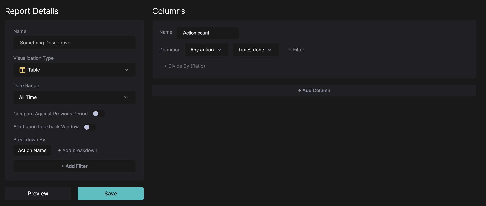
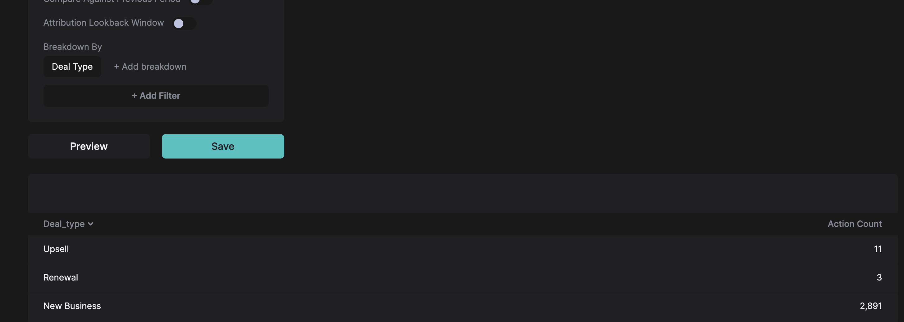

# Finding a list of all Action Names

Whenever you want to investigate the data that’s coming into HockeyStack you can use this technique.

1. Go to the [Definitions > Reports and create a new report](https://hockeystack.com/dashboard/report).
2. In the report screen, set:
    1. Breakdown = Action Name (under Action Properties)
    2. Column = Any Action - Times Done
    3. Date Range = All Times
    
    
    
3. Click preview. This will give you a list of all possible action names.
4. If you want to see which integration each action is coming from, you can add Integration (under Action Properties) as the breakdown.
5. You can take the same approach to investigate the values of other properties! For example, let’s say we want to investigate what values Deal Type can take. You just need to change the breakdown to Deal Type.
    
    