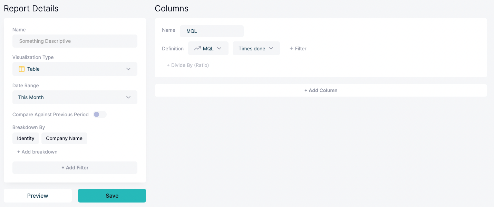
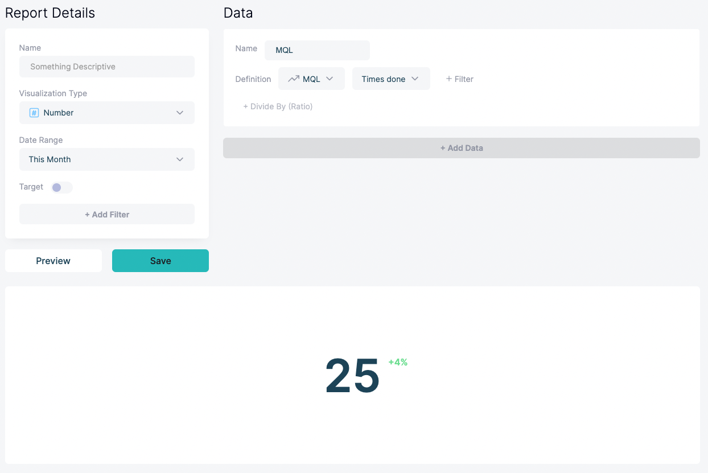
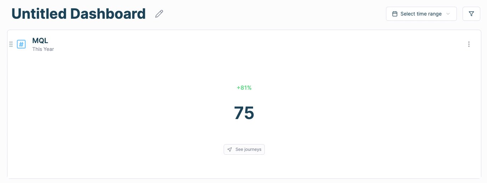
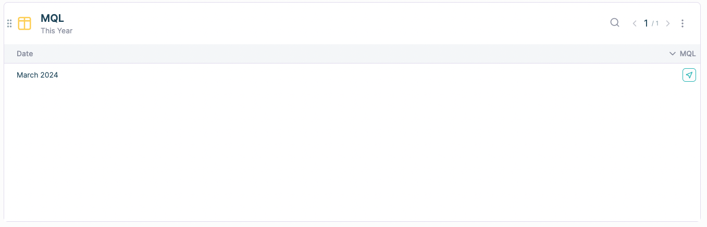
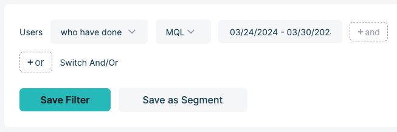

# How do I see which individuals / companies are included in a metric?

- **Approach 1: Create a report with an identity and/or company name breakdown.**
    
    “Identity” is a property that refers to the entity who performed the action. In the case of a marketing qualified lead, identity might be an email. In the case of an opportunity, identity might be the domain of a company (because the opportunity will not be tied to a single individual, it will be tied to the whole company). 
    
    Individuals can also possibly be tied to a company. So using a “Company Name” breakdown with both a marketing qualified lead and an opportunity will yield the company’s name if available.
    
    Read more below: 
    
    [The HockeyStack data model](../101-How-HockeyStack-Works/The-HockeyStack-data-model.md)
    
    So, building the below report:
    
    
    
    Might deliver a result like this:
    
    | Identity | Company Name | MQL |
    | --- | --- | --- |
    | michael@dundermifflin.com | Dunder Mifflin | 1 |
    | jake@gmail.com | (no value) | 1 |
- **Approach 2: Click into a number in an aggregated report**
    
    All numbers in table and number reports are clickable when added to a dashboard. For example, create the below report and add it to a dashboard:
    
    
    
    When you hover over it while in the dashboard, you can click on the button titled “See Journeys” to see the individuals and their journeys.
    
    
    
    You can hover over numbers in a table report to see a button with the same behavior.
    
    
    
- **Approach 3: Filter on the Journeys page**
    
    Navigate to [Journeys](https://hockeystack.com/dashboard/users), click on the configuration icon on the top right, and click “+ Add” next to User Filters.
    
    You can use User Filters to filter for the metric you want with the time range you want, and it will show you the individuals attached to it.
    
    
    
    You can click on the configuration icon once again, and click “Save As New View” to make this filter easily accessible on the sidebar as a saved view.