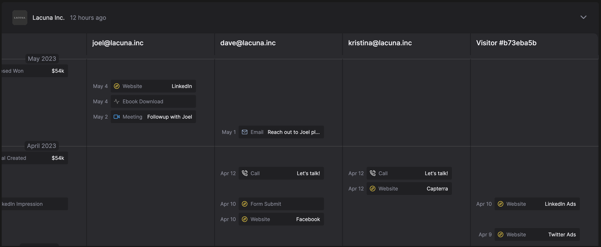

# 6sense

HockeyStack’s 6sense integration is used to tie anonymous visitors that land on your website to their companies, including the company firmographics, 6sense buying stage, and 6sense intent score, and 6sense ICP fit. This data is automatically connected to any other company-related data coming from other integrations like CRM, marketing automation, and LinkedIn Ads Impressions.

HockeyStack is an official 6sense partner. 

## Connecting to 6sense

There are two ways to integrate HockeyStack with 6sense:

- If you have 6sense’s script on your website, HockeyStack automatically adds a snippet onto your website called hockeystack-6sense.min.js, which pulls data from the 6sense script.
- If not, you can contact your account manager to turn on 6sense using API key.

## Property list that HockeyStack pulls from 6sense:

*company_domain*

*company_name*

*company_annual_revenue*

*company_country*

*company_number_of_employees*

*company_industry*

*6sense__confidence*

*6sense__buying_stage*

*6sense__intent_score*

*6sense__profile_score*

*6sense__profile_fit*

## Reverse IP Lookup:

With 6sense’s reverse IP database, you can identify companies visiting your website on their journeys:

You can also segment these journeys and all reports by company tiers, segments, and other properties on 6sense and your CRM.