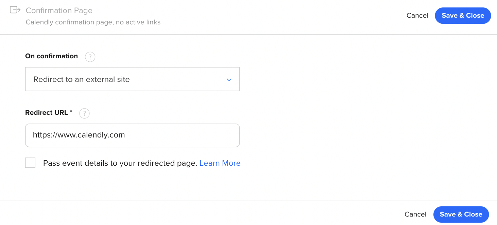

# Calendly

<aside>
💡 In order to use this integration, you need to be using a Professional or above plan in Calendly. This is required to have your users redirected back to your website after they book a time.

</aside>

**HockeyStack <> Calendly** integration identifies call bookings and tracks associated data (like the visitor’s answers in the booking form) automatically.

There are two important steps for this integration:

## 1. Turn on “Pass event details to your redirected page” for the events that you want to track

You can access this setting from the edit page of an event. This is how we access the data from the booking. The redirect URL page should include the main HockeyStack tracking script so that we can actually track the data.

## 2. That’s it!

Hopefully it was as easy for you as we planned :) But if you have any questions, shoot us an email or use any other channel where you can reach us!