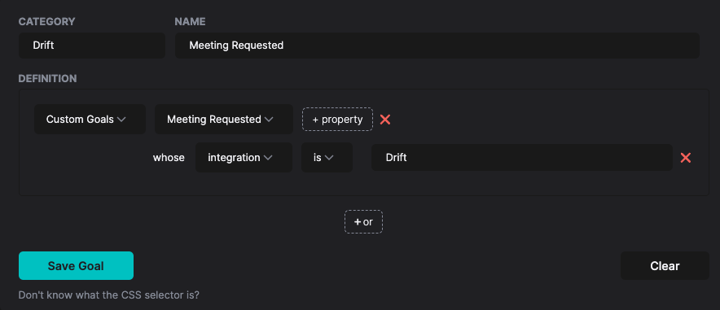

# Drift

HockeyStack’s Drift integration allows you to track conversation actions and automatically send them to HockeyStack to merge with the rest of your data. This means that you can analyze in which stage prospects interact with the live chat and how marketing efforts impact the conversion rate of chat-based actions.

## Connecting to Drift

If you have Drift’s website script (with source [js.driftt.com](http://js.driftt.com/)) installed on your website, HockeyStack can automatically detect it and start listening for any chatbot actions.

If you don’t see any Drift actions tracked, then you may need to add our Drift-HockeyStack script separately to your website to allow tracking. You can ask your customer success specialist for help.

## Tracking Drift Actions

HockeyStack tracks the following actions out of the box:

- Conversation Started
- Email Captured
- Meeting Requested
- Meeting Booked

We also track the Drift user id so even if visitors don’t give their emails now, we can merge it later once they do.

## Using Drift Actions in Dashboard

After making sure that you are able to track Drift chatbot actions, you can go ahead and define the goals as such:

Now, just like any other goal, you will be able to use this throughout the platform!