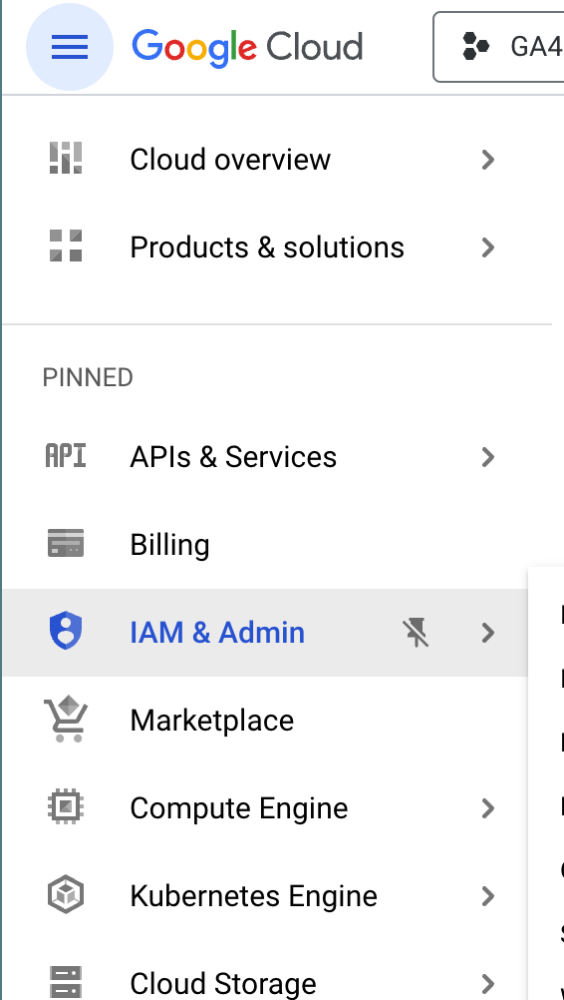
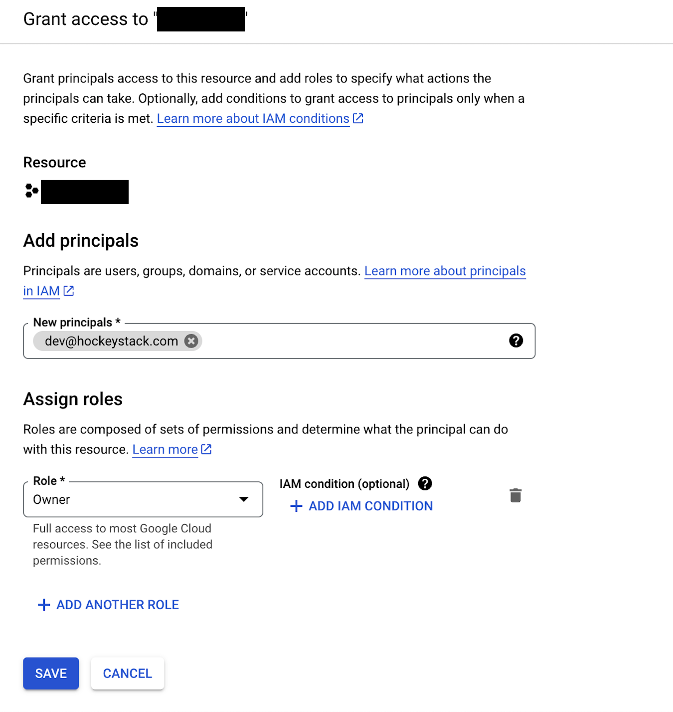

# Google Analytics

Using HockeyStack’s BigQuery integration, you can pull historical website data from Google Analytics into your HockeyStack account. This integration only works if you already have the data exported to BigQuery, as Google does not share historical data into BigQuery at the time of setup.

## Inviting HockeyStack as an Owner to the BigQuery project

Once the BigQuery project is set up, you should invite our HockeyStack account for us to be able to pull the data.

1. Go to the **IAM & Admin** page.
    
    
    
2. Click **+ GRANT ACCESS** to add a new user.
3. Add “dev@hockeystack.com” with **Owner** role. Click **Save**.
    
    