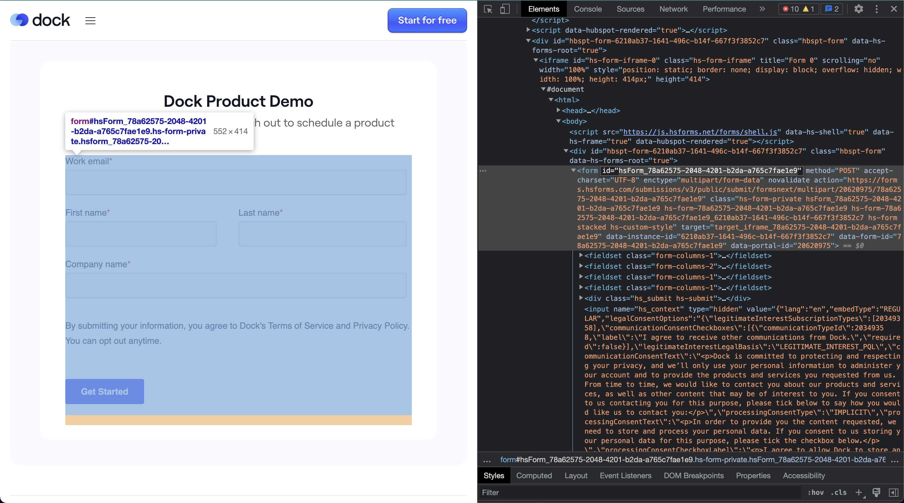
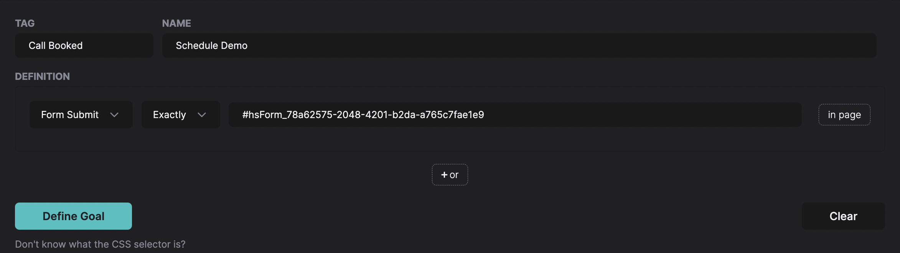

# HubSpot Website Tracking

If you are using a HubSpot form in your website or if you have the HubSpot meeting scheduler on your own domain, HockeyStack can automatically track the submission and schedule actions as well as identify that visitor.

## Form Submissions

Form submissions are tracked like any other form where you can see it in the Journeys tab and also define it as a goal.

Here, you can see an example form from [dock.us](http://dock.us). The important thing to note here is the `id` property in the `form` tag (”hsForm_78a62575-2048-4201-b2da-a765c7fae1e9”), which is highlighted in the photo.

You can then use this while defining your goal to select this specific form. All you have to do is select the “Form Submit” option and paste this value by adding a “#” to the beginning.

