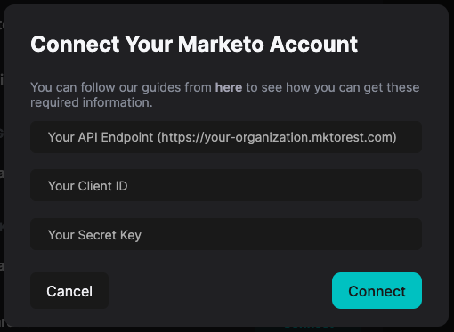

# Marketo

HockeyStack's Marketo integration pulls your marketing automation data from Marketo and connects it with the rest of your customer data. This includes Leads, Campaigns, Programs, and the key activities you track through Marketo.

# Connecting to Marketo

Before you can connect your Marketo account to HockeyStack, we need some additional information:

- Your Marketo API Endpoint
- Your Client ID
- Your Client Secret

Follow this guide on how to find these information: 

[How to Find Your Marketo Account Details](Marketo/How-to-Find-Your-Marketo-Account-Details.md)

Once you have these information, you can enter them to HockeyStack’s connection dialog in [Settings](https://hockeystack.com/dashboard/settings). HockeyStack can then automatically create the necessary authentication and connection flow.

# How It Works

When you integrate Marketo, HockeyStack pulls certain actions and properties from it. Each action comes with action properties that give more information about it.

For a full list of the objects and related actions we pull from Marketo, see [Marketo Pulled Actions List](Marketo/Marketo-Pulled-Actions-List.md).

# Historical Website Data

We also have a separate integration to pull historical website data that Marketo tracked before you install the HockeyStack script on your website. This integration only runs once to backfill your dashboards.

You don’t have to do anything else to access this data, your HockeyStack customer success specialist will activate this for you if you have already tracked website sessions through Marketo before.

# Technical Details

To satisfy Marketo’s API requirements, we pull activities in batches of 300 and process the result in series. We also need to make separate requests to get the custom properties of the Lead objects. 

Depending on your data volume, we pull the historical data on a monthly or daily basis and then move to daily basis for any new data after the initial setup. Marketo has a daily limit of 50k API requests and although we stay below this limit for daily data pulls, the historical data pull can get closer to the 50k limit. In that case, we stop processing and continue the next day when the limit is refreshed.

We look at the `activityDate` property and generate a `nextPageToken` to pull only the recently performed actions for each activity type. We store the last pulled date in our database, which allows us to never process the same data twice.