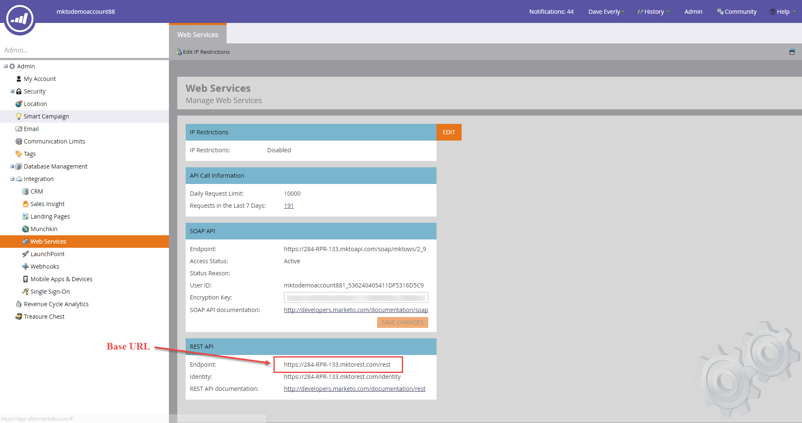
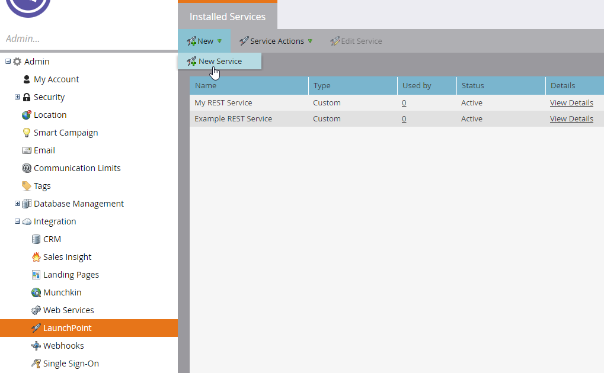
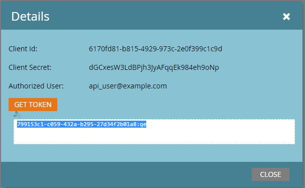

# How to Find Your Marketo Account Details

### Your Marketo API Endpoint

You can find this information in the **Admin > Integration > Web Services** page from the sidebar. It is called “**Endpoint”** under **REST API**.

### Your Client ID and Client Secret

To create the Client ID and Secret, we need to create a new custom service. First, navigate to **Admin > Launchpoint**. Click “**New Service**”.

Give your service a descriptive name (like “HockeyStack integration”) and select “**Custom**” from the **Service** dropdown menu. Give it a description, then select a user from the **API Only User** dropdown menu and click on “**Create**”.

We have now created our custom service. You should be able to see it in your list of LaunchPoint services, along with a button next to it called “**View Details**”. Click on it to access your Client ID and Secret.

