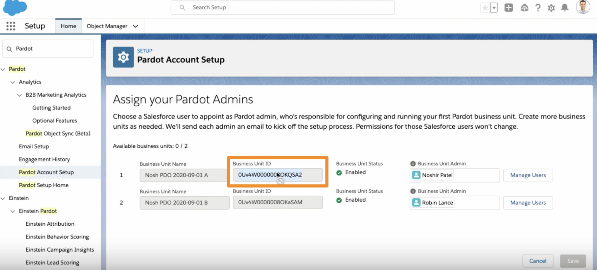

# Pardot

<aside>
⚠️ Before you connect your Pardot account, make sure that you’ve successfully connected your Salesforce account. Even though it is a separate integration, we have to pull your Pardot data through your Salesforce account.

</aside>

In order to connect to your Pardot account, we need your Pardot Business Unit ID. Don’t get afraid by the long name though, the process of getting this ID is very simple.

First, log into Salesforce using the same account you use to log into Pardot. On the **Setup** tab, navigate to **Pardot > Pardot Account Setup**.

You may see multiple users here but select the Business Unit ID of the user you want to connect to HockeyStack.

<aside>
⚠️ In order for us to pull the necessary data, this user should be an administrator.

</aside>