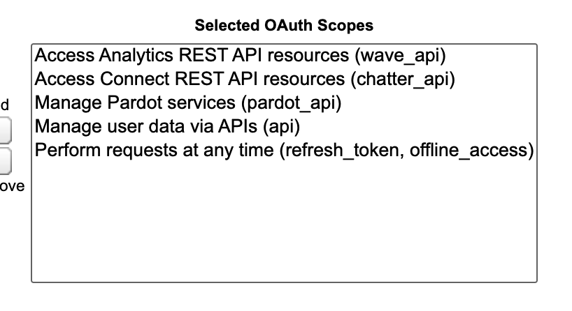

# Salesforce

HockeyStack's Salesforce integration pulls your sales data from Salesforce and connects it with the rest of your customer data. This includes Accounts, Contacts, Leads, Deals, Campaigns and more.

# Connecting to Salesforce

The Salesforce connection happens through a user with enough permissions giving access to the HockeyStack app after clicking Connect from [Settings](https://hockeystack.com/dashboard/settings) in your HockeyStack dashboard.

You can manage the connected app in Salesforce through Setup > Platform Tools > App Manager.

You can see the required permissions for the app here but any Salesforce user that has read access to the objects you want to pull into HockeyStack should be able to connect successfully.

# How It Works

When you integrate Salesforce, HockeyStack pulls certain actions and properties from it. Each action comes with action properties that give more information about it.

For a full list of the objects and related actions we pull from Salesforce, see [Salesforce Pulled Objects List](Salesforce/Salesforce-Pulled-Objects-List.md).

# Technical Details

Each request is able to pull 2000 records per object at a time and processes the results in series. Depending on your data volume, we pull the historical data on a monthly or daily basis and then move to daily basis for any new data after the initial setup.

As a rule of thumb, you can calculate the amount of requests being made as (# of records / 2000) per object.

We look at the `LastModifiedDate` property to pull only the recently modified records. This allows us to also keep track of updates along with creations. We also have processes that keep track of recently deleted objects to also reflect the change in HockeyStack.