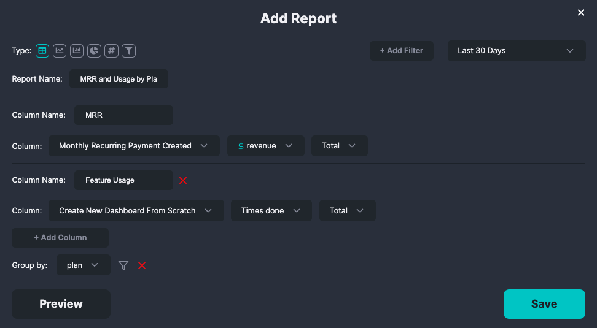

# Stripe

HockeyStack’s Stripe integration allows you to enrich your customers’ web and product interactions with their subscription revenue data.

# How to Install

Click the "Connect" button next to the Stripe logo in your [settings](https://www.hockeystack.com/dashboard/settings).

# How It Works

When you first integrate Stripe to HockeyStack, all your historical revenue data is pulled into HockeyStack. Then, HockeyStack defines the following goals for you to use in your reports and filters.

## Payment Received

Triggered when a payment is received. Records the total payment.

### Action properties

| Property | Type | Description |
| --- | --- | --- |
| **revenue** | Number | The payment amount. Can be used for attribution. |
| **currency** | String | The three-letter currency code of the payment |
| recurring | Boolean | Whether the charge is a one-time or recurring charge |
| plan_id | String | The unique id of the plan associated with this payment on Stripe. This property only appears if the payment received is part of a subscription. |
| period | Number | The number of months of subscription that this payment is for. For monthly subscriptions, this is 1. For yearly subscriptions, this is 12. |

## Monthly Recurring Payment Created

Triggered when an invoice is created for a future payment.

Records the monthly payment amount, regardless of the total payment invoiced. This means that if you create an invoice for an upfront payment for a yearly subscription, the payment amount is divided into 12 and recorded as 12 distinct goals in each following month.

You can use this for accrual accounting.

### Action properties

| Property | Type | Description |
| --- | --- | --- |
| **revenue** | Number | The payment amount. Can be used for attribution. Equal to the total payment amount divided by 12 if it is for a yearly subscription. |
| **currency** | String | The three-letter currency code of subscription’s payment amount |
| unit_price | Number | The price of a single unit of the product that is referenced in this invoice. Note that this amount **is not** divided by 12 if it is a yearly subscription. |
| quantity | Number | Number of units of the product included in the subscription |
| period | Number | The number of months that this subscription will last for. Always equals 1. |
| subscription_id | String | The unique id of the subscription on Stripe |

### User properties

| Property | Type | Description |
| --- | --- | --- |
| stripe_name | String | The customer’s name as recorded on Stripe |

## Monthly Recurring Payment Received

Triggered when a payment is received.

Records the monthly payment amount, regardless of the total payment made. This means that if you receive an upfront payment for a yearly subscription, the payment amount is divided into 12 and recorded as 12 distinct goals in each following month.

You can use this for cash basis accounting.

### Action properties

| Property | Type | Description |
| --- | --- | --- |
| **revenue** | Number | The monthly payment amount. Can be used for attribution. Equal to the total payment amount divided by 12 if it is for a yearly subscription. |
| **currency** | String | The three-letter currency code of the payment |
| recurring | Boolean | Whether the charge is a one-time or recurring charge. Always equals true. |
| plan_id | Stripe | The unique id of the plan associated with this payment on Stripe. This property only appears if the payment received is part of a subscription. |
| period | Number | The number of months that this subscription will last for. Always equals 1. |

## Subscription Created

Triggered when a new subscription is created.

### Action properties

| Property | Type | Description |
| --- | --- | --- |
| **revenue** | Number | The payment amount. Can be used for attribution. Equal to `unit_price * quantity` |
| **currency** | String | The three-letter currency code of subscription’s payment amount |
| unit_price | Number | The price of a single unit of the product that is referenced in this invoice |
| quantity | Number | Number of units of the product included in the subscription |
| period | Number | The number of months that this subscription will last for. For monthly subscriptions, this is 1. For yearly subscriptions, this is 12. |
| subscription_id | String | The unique id of the subscription on Stripe |

### User properties

| Property | Type | Description |
| --- | --- | --- |
| stripe_name | String | The customer’s name as recorded on Stripe |

## Subscription Updated

Triggered when an existing subscription is updated. Note that this is only triggered when

### Action properties

| Property | Type | Description |
| --- | --- | --- |
| **revenue** | Number | The payment amount. Can be used for attribution. Equal to `unit_price * quantity` |
| **currency** | String | The three-letter currency code of subscription’s payment amount |
| unit_price | Number | The price of a single unit of the product that is referenced in this invoice |
| quantity | Number | Number of units of the product included in the subscription |
| period | Number | The number of months that this subscription will last for. For monthly subscriptions, this is 1. For yearly subscriptions, this is 12. |
| subscription_id | String | The unique id of the subscription on Stripe |
| amount_changed | Number | The change in payment amount. Equal to `current revenue - previous revenue` |
| update_type | Enum
(’expansion’, ‘contraction’, ‘other’) | If `amount_changed` is positive, the update type is ‘expansion.’ If the `amount_changed` is negative, the update type is ‘contraction.’ Else, the update type is ‘other.’ |

### User properties

| Property | Type | Description |
| --- | --- | --- |
| stripe_name | String | The customer’s name as recorded on Stripe |
| isTrial | Boolean | Whether the customer is in trial or not |

## Subscription Cancelled

Triggered when a subscription is cancelled.

### Action properties

| Property | Type | Description |
| --- | --- | --- |
| **revenue** | Number | The payment amount. Can be used for attribution. Equal to `unit_price * quantity` |
| **currency** | String | The three-letter currency code of subscription’s payment amount |
| unit_price | Number | The price of a single unit of the product that is referenced in this invoice |
| quantity | Number | Number of units of the product included in the subscription |
| period | Number | The number of months that this subscription will last for. For monthly subscriptions, this is 1. For yearly subscriptions, this is 12. |
| subscription_id | String | The unique id of the subscription on Stripe |

### User properties

| Property | Type | Description |
| --- | --- | --- |
| stripe_name | String | The customer’s name as recorded on Stripe |

# Usage Examples

### MRR and Feature Usage by Plan

You can segment users into subscription plans and then analyze the MRR that each plan brings as well as their feature usages.

To create the report:

1. Create a new dashboard if you haven’t already.
2. Create a new report with the Table type.
3. Enter the following details:
    
    
    

# Caveats

- If payments are received in multiple different currencies, HockeyStack converts the payment amount to your account’s main currency **when displaying the report**. Your account’s main currency is USD by default, but you can change it from the settings at any time.
- The user identity passed from Stripe to HockeyStack is either the customer’s email or the customer’s unique id on Stripe.
- When a user updates their subscription, Stripe does not create an invoice until the next payment. Regardless of this, we create the “Monthly Recurring Payment Created” goal at the time of the subscription update, since it fits the accrual accounting principle better this way.

# Known Problems

If you definitely need these for your business processes, let us know at [hello@hockeystack.com](mailto:hello@hockeystack.com) and we’ll work out a solution 😉

- While pulling historical data, HockeyStack can not pull subscription updated events due to limitations of the Stripe API.
- If a subscription is updated before a pending invoice is paid, the accrual revenue data might be incorrect for that month. This is because we do not handle pending invoices just yet.

# FAQ

- **What does Boolean mean?**
    
    If a field is a boolean, it means that that field can be either **true** or **false**.
    
- **What does String mean?**
    
    If a field is a string, it means that the field contains text.
    
- **What does Enum mean?**
    
    If a field is an enum, it means that the field can take only one of a known set of text-based values.