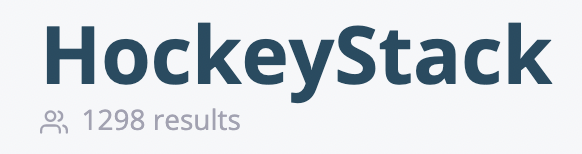
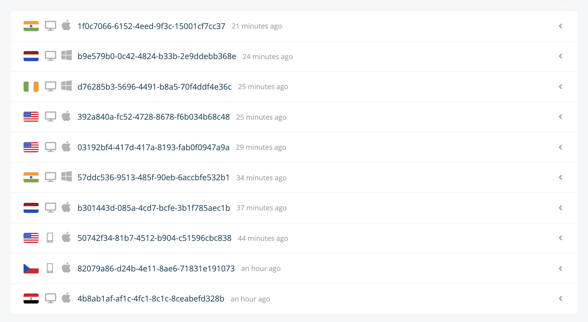
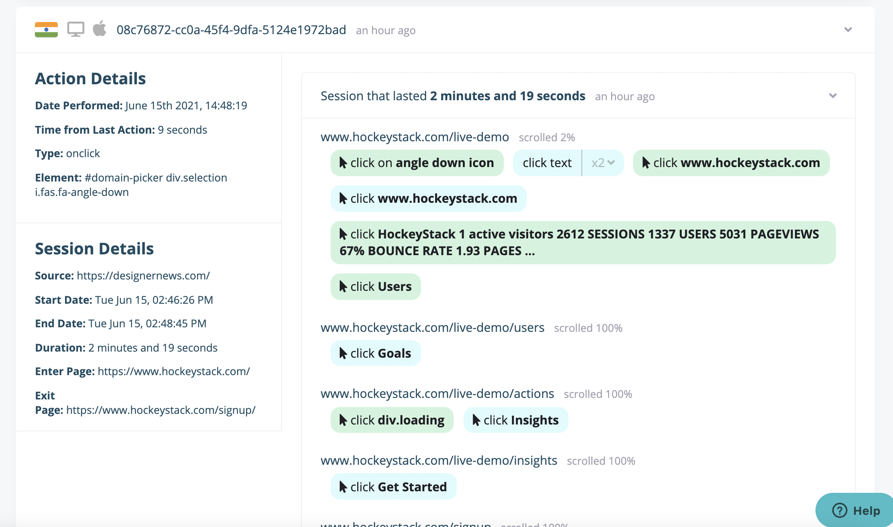

# Journeys

The journeys section is made to show exactly what your visitors did on your website, from scrolling to clicking and searching.

# Result Count

Under your company name, you can see how many users there are for a given filter.

# The Users List

In the list, you can see an overview of the sessions you will see for that filter. The flag shows their country. The icons show their device and operating system. The random-seeming text in the middle is their identifier. If you assign an identity to a user, it will show up here instead of HockeyStack's own identifier. The time indicator shows the time elapsed from the user's last sessions's end date. If the user is still on the website, you will see a green dot next to the flag.

# A single user

Clicking on a user on the list toggles their sessions. Sessions are sorted from the newest to the oldest. The user's last session will be toggled automatically, and their other sessions will be closed to give you an overview of their activity. Clicking on a session on the right side will show that session's details on the left side.

## Actions

All actions a user takes are presented on the sessions on the right side. Most of these will be click actions, though searches and custom goals are also presented.

Click actions are divided into 2 categories. If a user clicks a text element, this is displayed in blue. Multiple back-to-back clicks to text elements are simply shown as "click text" with an "x2" next to it. Clicking on the "x2" toggles the text click actions it includes. If a user clicks another element, these are displayed in green.

We do whatever we can to eliminate html selectors from the sessions view. Clicking on a font awesome icon is displayed as "click <icon name> icon." Clicking on elements that include text is displayed with that element's text. For elements that do not include text, there is not much we can do. HockeyStack takes the selector's last part so that it doesn't take up too much space.

Clicking on an action on the right side will replace User Details with Action Details. A button will appear beneath Session Details that will allow you to define that action as a goal with a single click.

## Switching between Calendar and List View

[https://app.arcade.software/share/FrshRopGWdBO6CJwMec5](https://app.arcade.software/share/FrshRopGWdBO6CJwMec5)