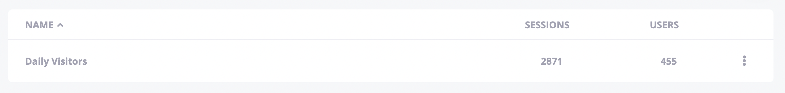

# Segments

Segments are useful for grouping certain users together and analyzing that group independently. It can also be said that segments are "saved filters." To learn how to define a segment, check out [our filtering guide](Filtering.md). You can use this method on the + button on the top right corner of the Segments tab, or you can just save your filter as a segment wherever you see a filter card.

A key difference is that the date ranges on segments are "rolling". For example, let's say you define a segment with the "Last 7 Days" date range on May 7. On that date, the segment will point to the dates between May 1 - May 7. If you use this segment the next day, it will point to the dates between May 2 - May 8.

Your segments will be listed on the Segments tab along with the number of sessions and users it contains. Clicking on its name will take you to the Users tab filtered by that segment.

---

If you have any other questions or issues, you can always reach us through the live support or just sending an email to [hello@hockeystack.com](mailto:hello@hockeystack.com)!