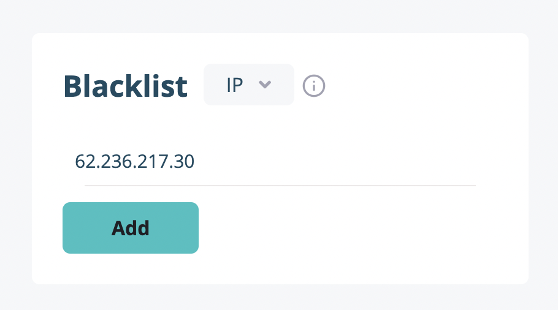

# Excluding Users From Your Data

You can blacklist users by IP or UUID. The most common use case for the IP blacklist is to exclude yourself from the data. So when you click "Add," the textbox will be prefilled with your own IP. If you have a dynamic IP address, you can find your own UUID from the Users tab and use that as the blacklist.

---

If you have any other questions or issues, you can always reach us through the live support or just sending an email to [hello@hockeystack.com](mailto:hello@hockeystack.com)!