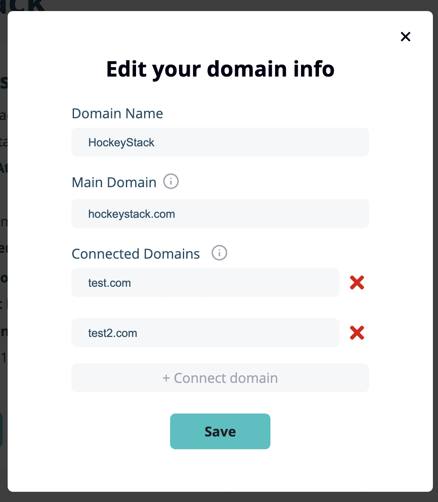

# Tracking Multiple Domains on One Dashboard

If you have multiple domains that are part of the same sales funnel, you will need to see all of their data on the same dashboard.

Click "Edit" in the "Domain Details" card and click "+ Connect domain". After saving these settings, you will be able to integrate this domain into the same dashboard. You can use our [integration guide](https://www.notion.so/The-Definitive-Guide-to-Your-Initial-Integration-1fc18626ee81470fa30e5be4dfc5ca51?pvs=21) with the API key in the "Domain Details" card to integrate your new connected domain.

<aside>
💡 You should still add the tracking script to all domains and pages you want to track.

</aside>

---

If you have any other questions or issues, you can always reach us through the live support or just sending an email to [hello@hockeystack.com](mailto:hello@hockeystack.com)!